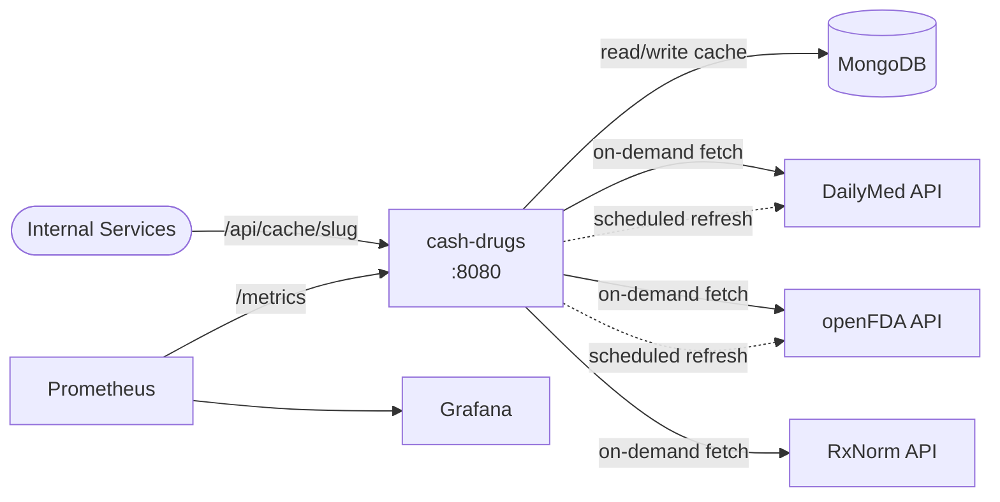
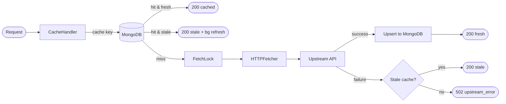
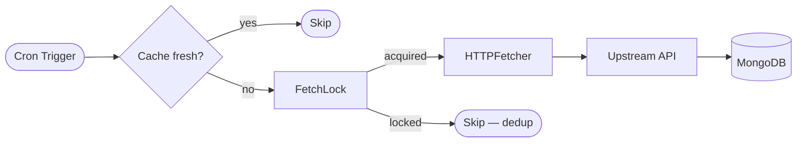
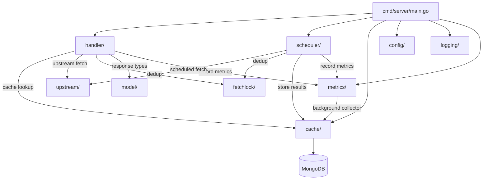

# cash-drugs

**Configure once, cache forever, use everywhere.**

Point cash-drugs at any REST API — it fetches the data, stores it in MongoDB, and serves it back instantly. Your microservices hit cash-drugs instead of upstream APIs. One cache, zero redundant calls.

```yaml
# config.yaml — that's it
endpoints:
  - slug: users
    base_url: https://api.example.com
    path: /v1/users
    format: json
```

```bash
# Every service gets the same cached data
curl http://localhost:8080/api/cache/users
```

## Why

Every internal service calling the same external API means:
- **Redundant requests** — 10 services × same API = 10× the calls
- **Rate limit pain** — one service burns the quota, all services fail
- **Cascade failures** — upstream goes down, everything goes down

cash-drugs sits in between. Call once, cache in MongoDB, serve to everyone. When upstream goes down, your services keep running on cached data.

## Quick Start

```bash
docker-compose up
```

Service starts at **http://localhost:8080**. Explore:
- **Swagger UI:** http://localhost:8080/swagger/
- **All endpoints:** http://localhost:8080/api/endpoints
- **Cache status:** http://localhost:8080/api/cache/status
- **Slug metadata:** http://localhost:8080/api/cache/{slug}/_meta
- **Bulk lookup:** `POST` http://localhost:8080/api/cache/{slug}/bulk
- **Test fetch:** `POST` http://localhost:8080/api/test-fetch
- **Health:** http://localhost:8080/health
- **Readiness:** http://localhost:8080/ready
- **Version:** http://localhost:8080/version
- **Metrics:** http://localhost:8080/metrics

## Configure Any API

Add entries to `config.yaml`. Each entry becomes a cached endpoint at `/api/cache/{slug}`.

### Simple (fetch on demand)

```yaml
endpoints:
  - slug: products
    base_url: https://api.example.com
    path: /v1/products
    format: json
```

→ `GET /api/cache/products`

### Auto-paginated (fetch all pages)

```yaml
  - slug: all-items
    base_url: https://api.example.com
    path: /v1/items
    format: json
    pagination: all
    pagesize: 50
```

cash-drugs walks every page automatically and stores them as separate MongoDB documents (no 16MB limit). Consumers get one combined response.

### Offset pagination (skip/limit APIs)

Some APIs use offset-based pagination (e.g., FDA openFDA). Set `pagination_style: offset`:

```yaml
  - slug: fda-enforcement
    base_url: https://api.fda.gov
    path: /drug/enforcement.json
    format: json
    pagination_style: offset
    pagination: all
    pagesize: 100
    data_key: results
    total_key: meta.results.total
    refresh: "0 3 * * *"
    ttl: "24h"
```

The fetcher sends `skip=0&limit=100`, `skip=100&limit=100`, etc. If the API caps skip (e.g., FDA's 25K limit), cash-drugs stops gracefully and stores whatever was fetched.

### Custom response structure

APIs return data in different JSON keys. Use `data_key` and `total_key` to tell cash-drugs where to find items and totals:

```yaml
  - slug: fda-enforcement
    base_url: https://api.fda.gov
    path: /drug/enforcement.json
    format: json
    pagination_style: offset
    data_key: results              # Items are in "results", not "data"
    total_key: meta.results.total  # Total count at nested dot-path
```

`total_key` supports dot-notation for nested paths (e.g., `meta.results.total` traverses `response.meta.results.total`).

### Optional query parameters

Query params with `{PLACEHOLDER}` values are optional — only params the caller provides are sent upstream. Unresolved placeholders are silently dropped:

```yaml
  - slug: search
    query_params:
      q: "{QUERY}"
      category: "{CAT}"
      status: "active"       # Static — always sent
```

→ `GET /api/cache/search?QUERY=aspirin` sends `q=aspirin&status=active` (no `category`)
→ `GET /api/cache/search?QUERY=aspirin&CAT=drugs` sends all three

### Search params (openFDA-style)

For APIs like openFDA that take a single `search` query param with multiple clauses, use `search_params`. Each clause is optional — only resolved ones are joined with `+` and sent as `search`:

```yaml
  - slug: fda-ndc
    base_url: https://api.fda.gov
    path: /drug/ndc.json
    format: json
    pagination_style: offset
    pagesize: 100
    data_key: results
    total_key: meta.results.total
    search_params:
      - "brand_name:\"{BRAND_NAME}\""
      - "generic_name:\"{GENERIC_NAME}\""
      - "product_ndc:\"{NDC}\""
```

→ `GET /api/cache/fda-ndc?BRAND_NAME=Tylenol` sends `search=brand_name:"Tylenol"`
→ `GET /api/cache/fda-ndc?BRAND_NAME=Tylenol&NDC=12345` sends `search=brand_name:"Tylenol"+product_ndc:"12345"`

### Scheduled refresh

```yaml
  - slug: inventory
    base_url: https://api.example.com
    path: /v1/inventory
    format: json
    pagination: all
    refresh: "0 */4 * * *"   # Every 4 hours
    ttl: "4h"                 # Serve stale + background refresh after 4h
```

Cache stays fresh automatically. When TTL expires, stale data is served instantly while a background fetch runs — consumers never wait.

### With parameters

```yaml
  - slug: user-detail
    base_url: https://api.example.com
    path: /v1/users/{USER_ID}
    format: json
```

→ `GET /api/cache/user-detail?USER_ID=123`

Parameters work in paths and query values:

```yaml
  - slug: search
    base_url: https://api.example.com
    path: /v1/search
    format: json
    query_params:
      q: "{QUERY}"
      category: "{CAT}"
```

→ `GET /api/cache/search?QUERY=aspirin&CAT=drugs`

### Raw format (XML, HTML, binary)

```yaml
  - slug: report-xml
    base_url: https://api.example.com
    path: /v1/reports/{ID}.xml
    format: raw
```

Stores the response body as-is with the original content type. No JSON envelope.

## Monitoring

cash-drugs exposes Prometheus metrics at `/metrics` for full operational observability.

```bash
curl http://localhost:8080/metrics
```

Key metrics:
- **Cache performance:** hit/miss/stale ratio per slug
- **Request throughput:** request rate and P95 latency per slug
- **Upstream health:** fetch duration, error rate, pages per slug
- **MongoDB health:** connection status, ping latency, document counts
- **Scheduler:** job success/failure rate, duration per slug

A pre-built Grafana dashboard is included at [`docs/grafana/cash-drugs-dashboard.json`](docs/grafana/cash-drugs-dashboard.json) with a `$slug` filter variable.

For full setup instructions including Prometheus scrape config, Docker Compose integration, PromQL queries, and alerting rules, see [`docs/prometheus-setup.md`](docs/prometheus-setup.md).

Operational runbooks for common alert scenarios (MongoDB down, circuit breaker open, high latency, upstream errors, memory pressure, concurrency exhaustion, scheduler stalled) are in [`docs/runbooks/`](docs/runbooks/runbook-index.md).

## Multi-Instance Deployment

Run multiple instances behind a load balancer. One leader runs the scheduler and warmup, replicas serve requests only.

```yaml
# Leader instance
environment:
  ENABLE_SCHEDULER: "true"

# Replica instance(s)
environment:
  ENABLE_SCHEDULER: "false"
```

`GET /version` returns `"leader": true/false` to identify which instance is the scheduler leader. The `cashdrugs_instance_leader` Prometheus gauge (1=leader, 0=replica) enables alerting when no leader is active.

## How It Works

```
Your Services → cash-drugs → MongoDB cache
                     ↕              ↕
               Upstream APIs   Prometheus → Grafana
```

1. **First request** → cache miss → fetch from upstream → store in MongoDB → return
2. **Subsequent requests** → served from cache (< 50ms)
3. **Scheduled refresh** → cron job fetches in background → cache stays fresh
4. **TTL expired** → serve stale immediately → background refresh → next request gets fresh data
5. **Upstream down** → serve last cached response with `stale: true`
6. **No cache at all + upstream down** → 502

## Response Format

JSON endpoints return:

```json
{
  "data": [ ... ],
  "meta": {
    "slug": "products",
    "source_url": "https://api.example.com/v1/products",
    "fetched_at": "2026-03-07T15:59:13Z",
    "page_count": 12,
    "stale": false,
    "results_count": 1234
  }
}
```

## Error Codes

All error responses include a stable `error_code` field for programmatic handling. Codes follow the pattern `CD-{CATEGORY}{NNN}`.

| Code | HTTP | Meaning | Retry? |
|------|------|---------|--------|
| `CD-H001` | 404 | Endpoint slug not configured | No — check config |
| `CD-H002` | 200 | Force-refresh blocked by cooldown | Cached data returned |
| `CD-U001` | 502 | Upstream fetch failed, no cached data available | Yes — upstream may recover |
| `CD-U002` | 404 | Upstream API returned 404 for the given parameters | No — check parameters |
| `CD-U003` | 503 | Circuit breaker open — upstream is failing | Yes — respect `retry_after` |
| `CD-H003` | 400 | Required parameters not provided | No — check endpoint params |
| `CD-H004` | 405 | HTTP method not allowed for this endpoint | No — use correct method |
| `CD-H005` | 400 | Malformed request body or invalid parameters | No — fix request |
| `CD-S001` | 503 | Service overloaded — concurrency limit reached | Yes — respect `Retry-After` header |

Error response envelope:

```json
{
  "error": "upstream unavailable",
  "error_code": "CD-U001",
  "slug": "drugnames",
  "request_id": "a1b2c3d4-...",
  "retry_after": 30
}
```

Every response includes an `X-Request-ID` header for tracing. If the caller sends `X-Request-ID`, cash-drugs preserves it; otherwise a UUID v4 is generated.

## Go Client

```go
resp, _ := http.Get("http://cash-drugs:8080/api/cache/products")
defer resp.Body.Close()

var result struct {
    Data []Product `json:"data"`
    Meta struct {
        Stale bool `json:"stale"`
    } `json:"meta"`
}
json.NewDecoder(resp.Body).Decode(&result)
```

## Configuration Reference

| Field | Required | Default | Description |
|-------|----------|---------|-------------|
| `slug` | yes | — | Unique name, becomes `/api/cache/{slug}` |
| `base_url` | yes | — | Upstream base URL |
| `path` | yes | — | Path, supports `{PARAM}` placeholders |
| `format` | yes | — | `json`, `xml`, or `raw` |
| `query_params` | no | — | Static or `{PARAM}` query parameters (unresolved placeholders skipped) |
| `search_params` | no | — | List of optional search clauses joined with `+` into `search` param |
| `pagination` | no | `1` | `"all"` or max page count |
| `pagination_style` | no | `page` | `page` (page/pagesize) or `offset` (skip/limit) |
| `page_param` | no | `page` | Query param for page number (page style only) |
| `pagesize_param` | no | `pagesize` | Query param for page size (page style only) |
| `pagesize` | no | `100` | Items per page (or limit for offset style) |
| `data_key` | no | `data` | JSON key containing the items array |
| `total_key` | no | `metadata.total_pages` | Dot-path to total count (pages or items) |
| `flatten` | no | `false` | Flatten nested arrays in response data |
| `refresh` | no | — | Cron expression for background refresh |
| `ttl` | no | — | Go duration (`1h`, `30m`) for staleness |
| `log_level` | no | `warn` | Log level: `debug`, `info`, `warn`, `error` |

## Environment Variables

| Variable | Default | Description |
|----------|---------|-------------|
| `CONFIG_PATH` | `config.yaml` | Path to config file |
| `MONGO_URI` | — | MongoDB connection string |
| `LISTEN_ADDR` | `:8080` | Server listen address |
| `LOG_LEVEL` | `warn` | Overrides config file log level |
| `LOG_FORMAT` | `json` | `json` or `text` |
| `MAX_CONCURRENT_REQUESTS` | `50` | Max in-flight requests (concurrency limiter) |
| `LRU_CACHE_SIZE_MB` | `256` | In-memory LRU cache size |
| `SYSTEM_METRICS_INTERVAL` | `15s` | System metrics collection interval |
| `CIRCUIT_FAILURE_THRESHOLD` | `5` | Consecutive failures before circuit opens |
| `CIRCUIT_OPEN_DURATION` | `30s` | How long circuit stays open |
| `FORCE_REFRESH_COOLDOWN` | `30s` | Cooldown between forced refreshes per key |
| `ENABLE_SCHEDULER` | `true` | Enable scheduler + warmup (set `false` for replica instances) |
| `WARMUP_QUERIES_PATH` | `warmup-queries.yaml` | Path to parameterized warmup queries file |

## Architecture

### System Overview



### Request Flow



### Scheduler Flow



### Project Structure



> Full sequence diagrams with error paths and pagination flows: [`docs/sequence-diagram.md`](docs/sequence-diagram.md)

## Development

```bash
# Run with Docker
docker-compose up

# Run directly
MONGO_URI=mongodb://localhost:27017/cash-drugs go run ./cmd/server

# Tests
make test-unit          # Fast, no Docker
make test-integration   # Full suite with MongoDB
make test-coverage      # Coverage report

# Lint
go vet ./...
```

## Tech Stack

Go 1.22+ · MongoDB · Docker Compose · `log/slog` · swaggo/swag · Prometheus client_golang · gobreaker (circuit breaker)
