# cash-drugs Sequence Diagrams

## Cache Lookup Flow (Happy Path)

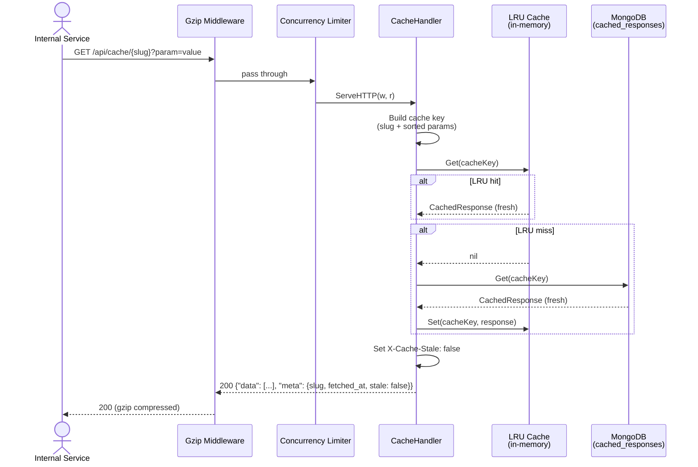

## Cache Miss — Upstream Fetch Flow

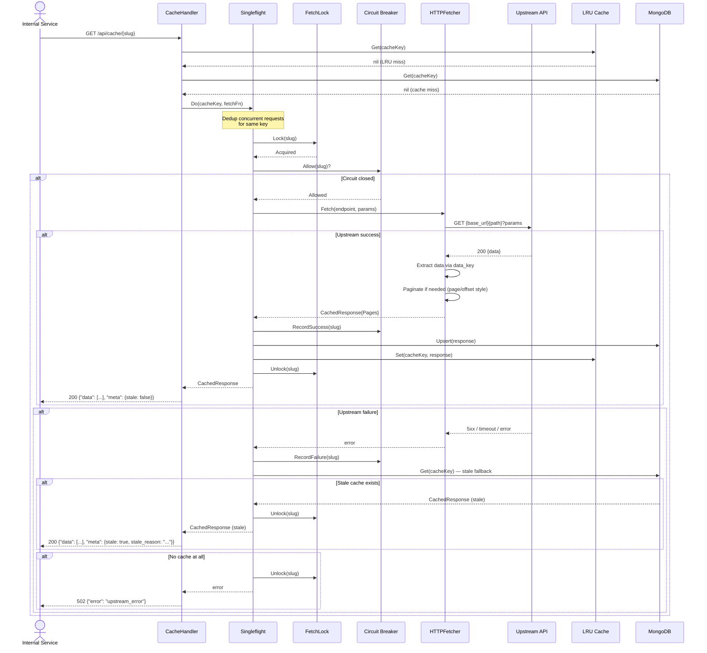

## Stale-While-Revalidate Flow

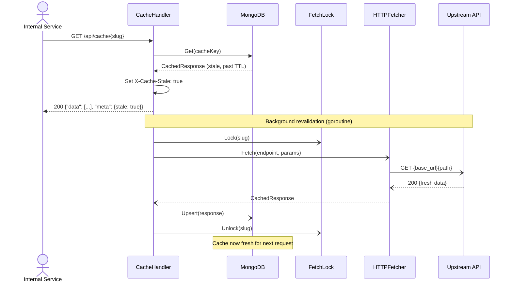

## Concurrency Limiter Flow

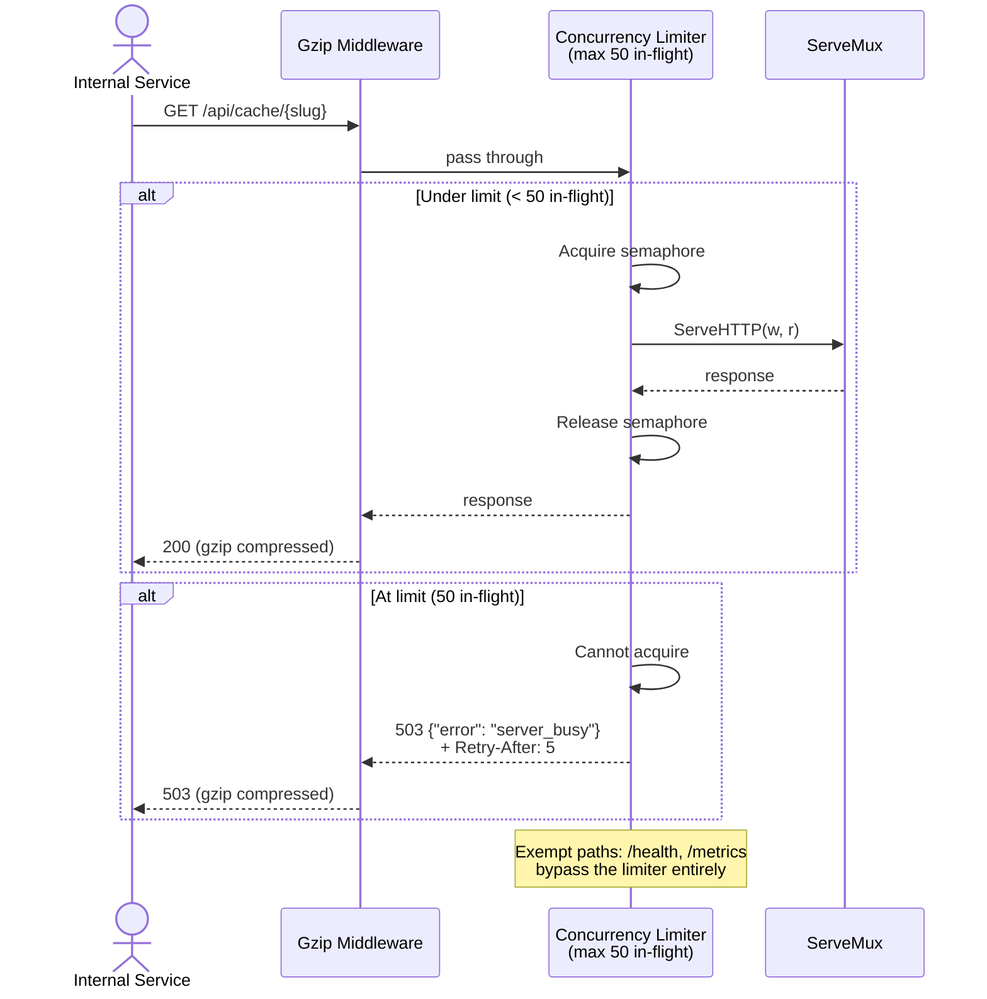

## Circuit Breaker Flow

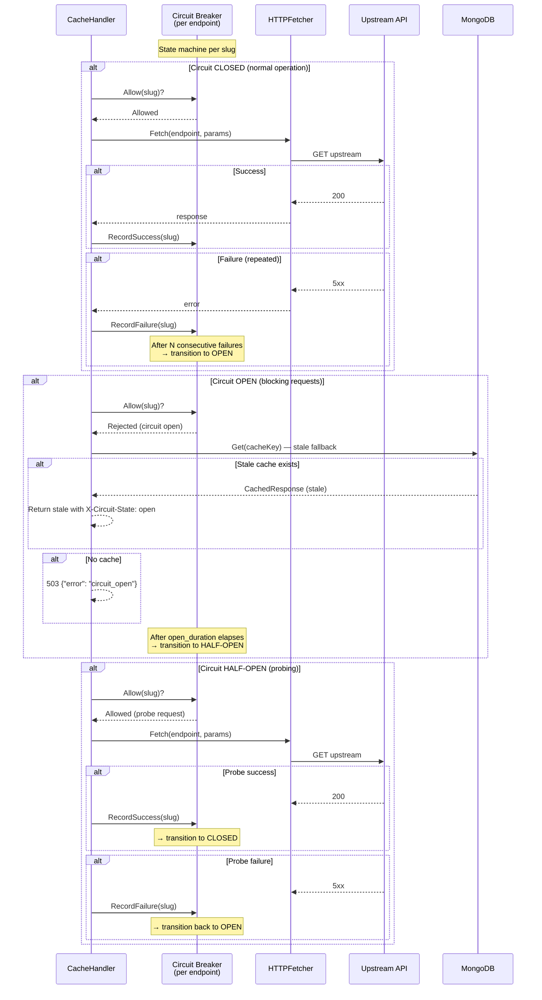

## Force-Refresh Cooldown Flow

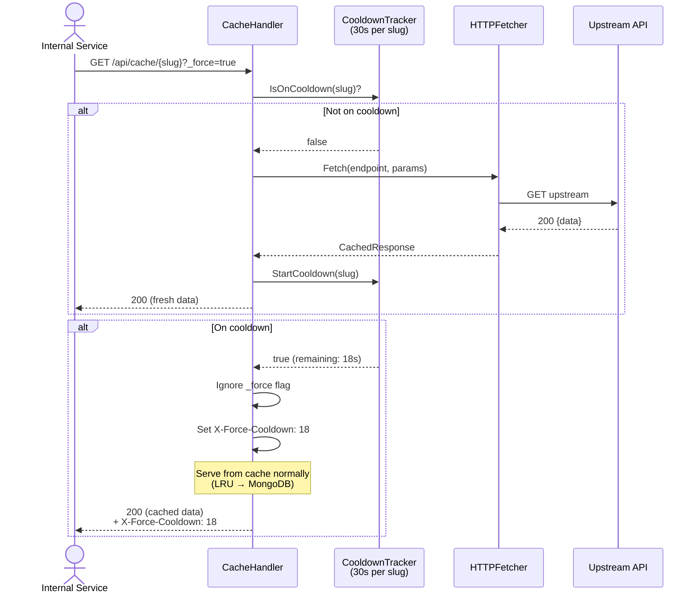

## Container System Metrics Flow

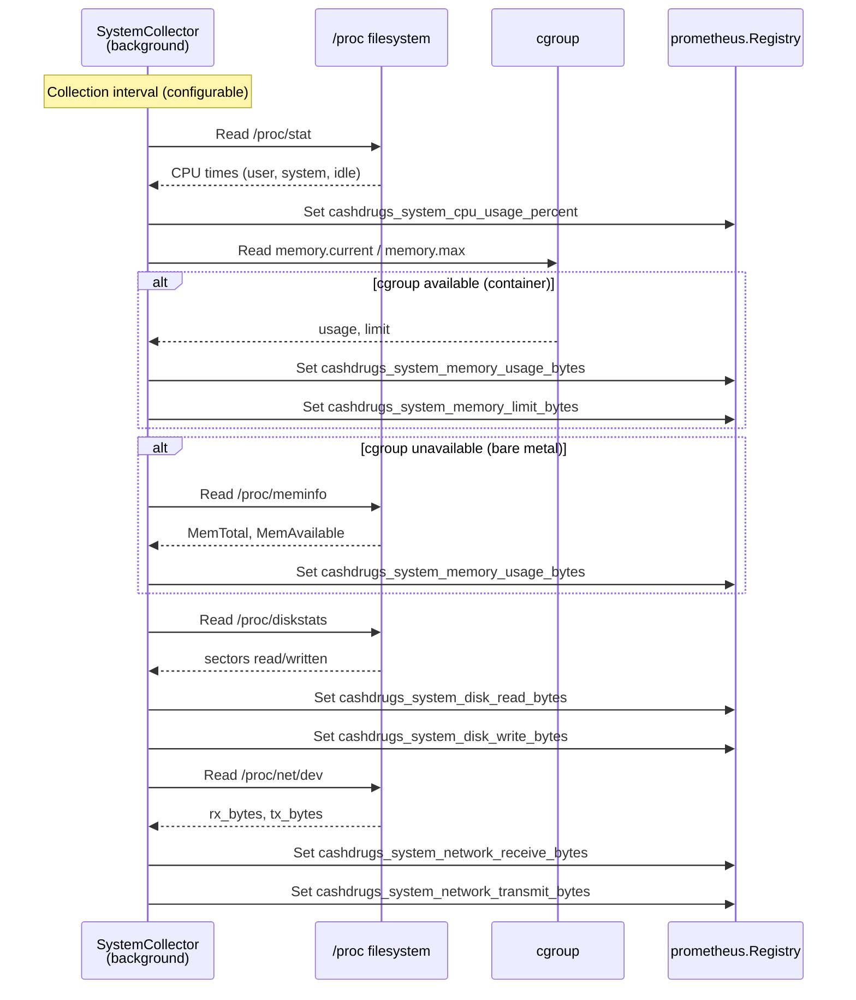

## Paginated Fetch Flow

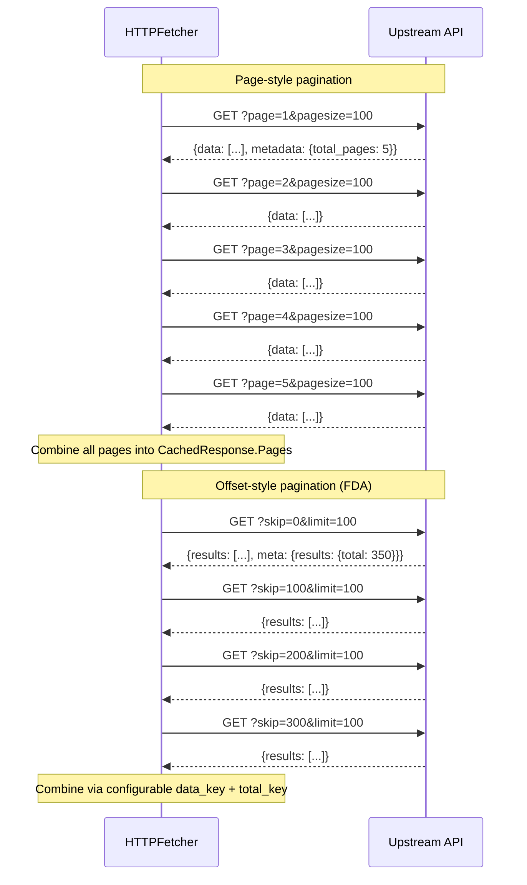

## Scheduled Refresh Flow

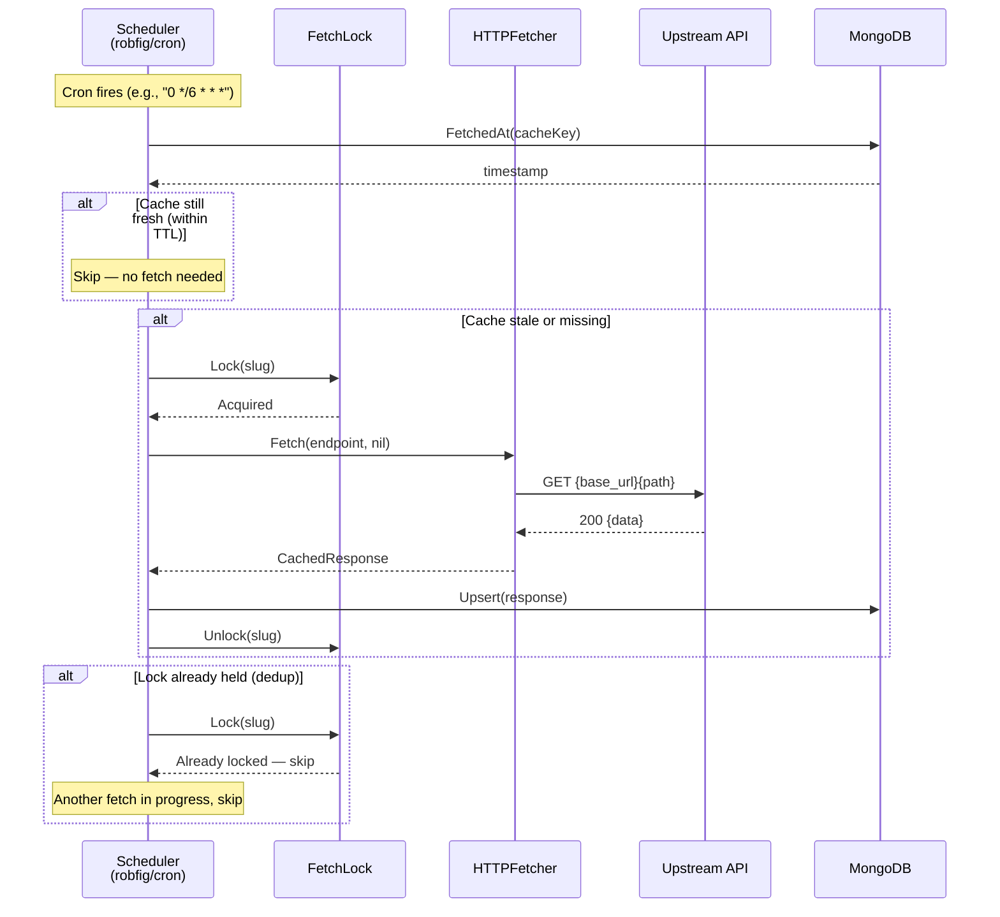

## Health Check Flow

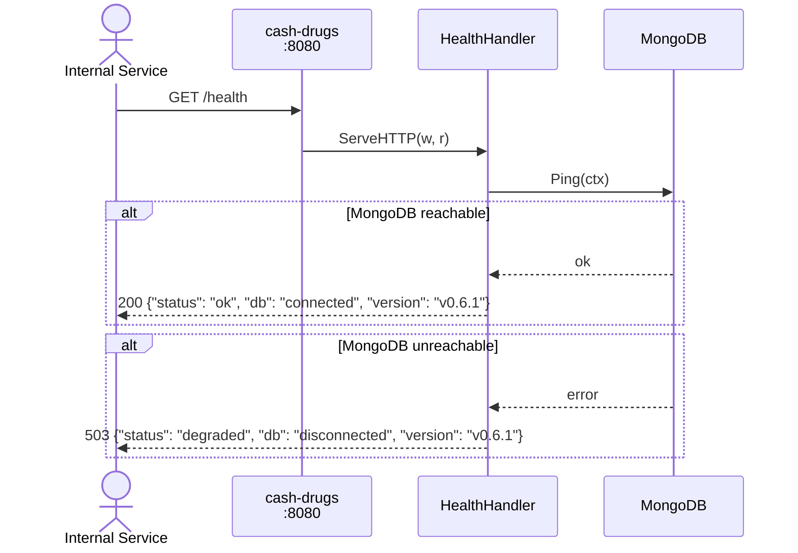

## Endpoint Discovery Flow

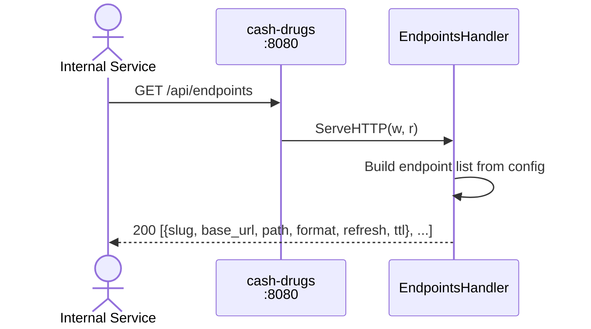

## Prometheus Metrics Flow

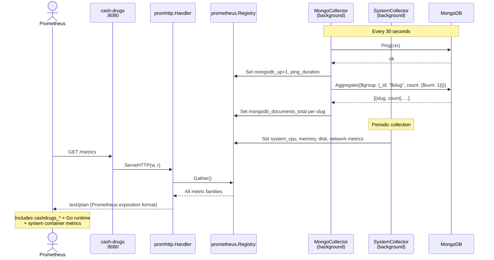

## System Overview

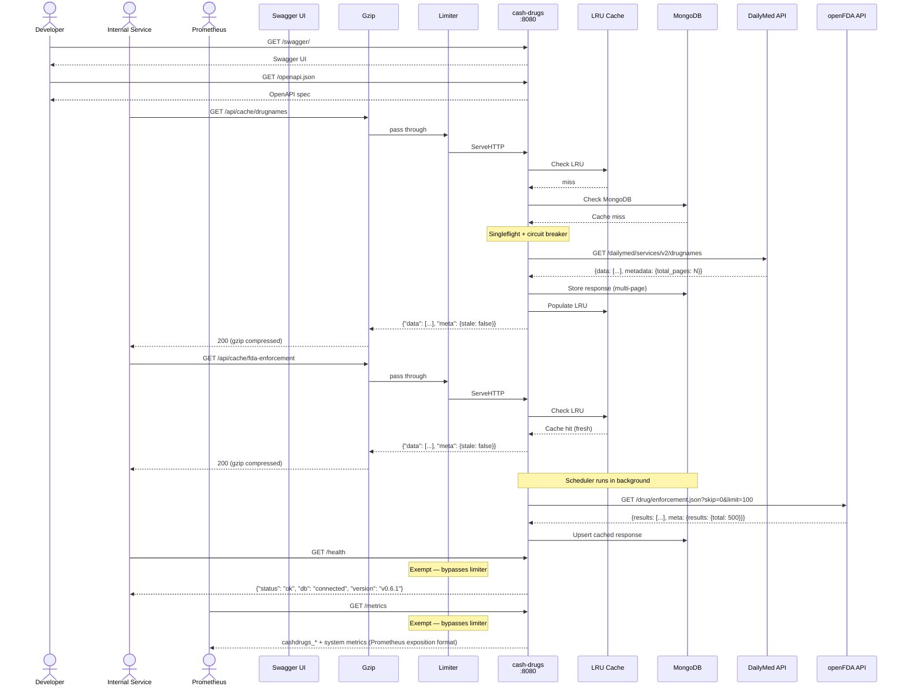
