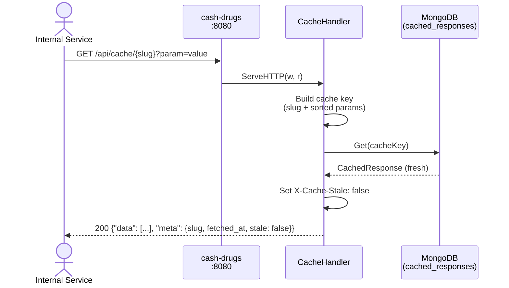
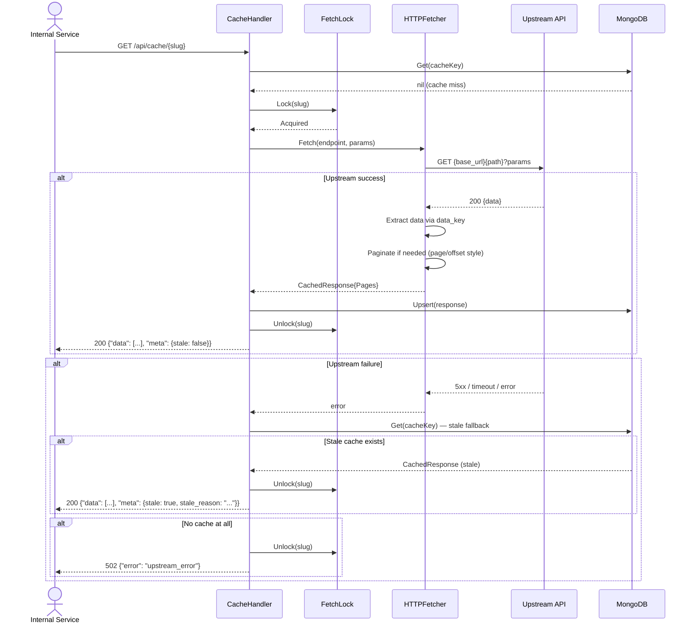
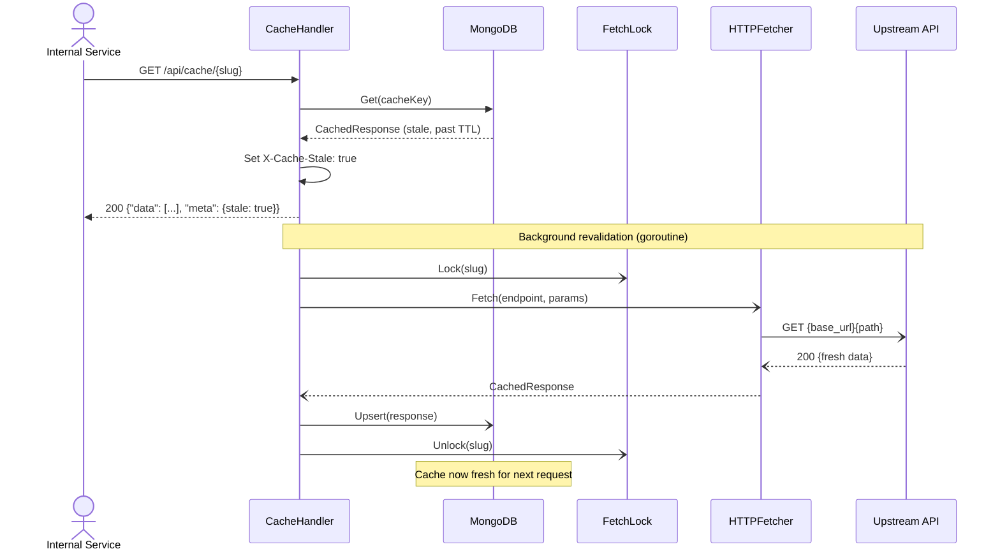
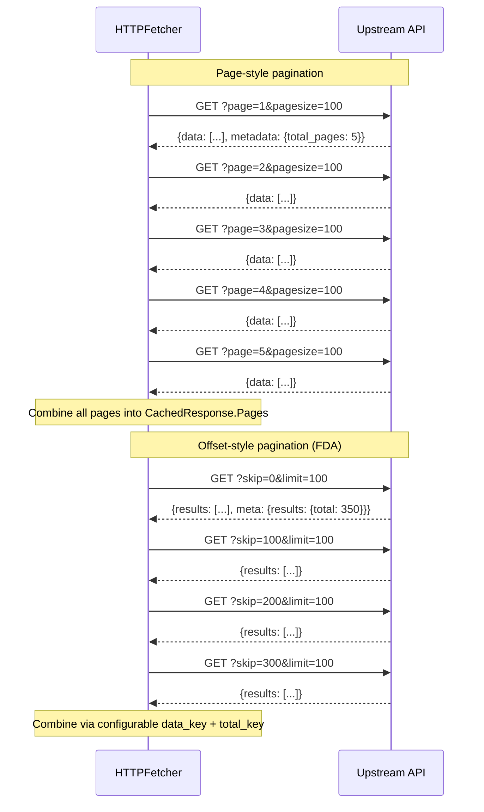
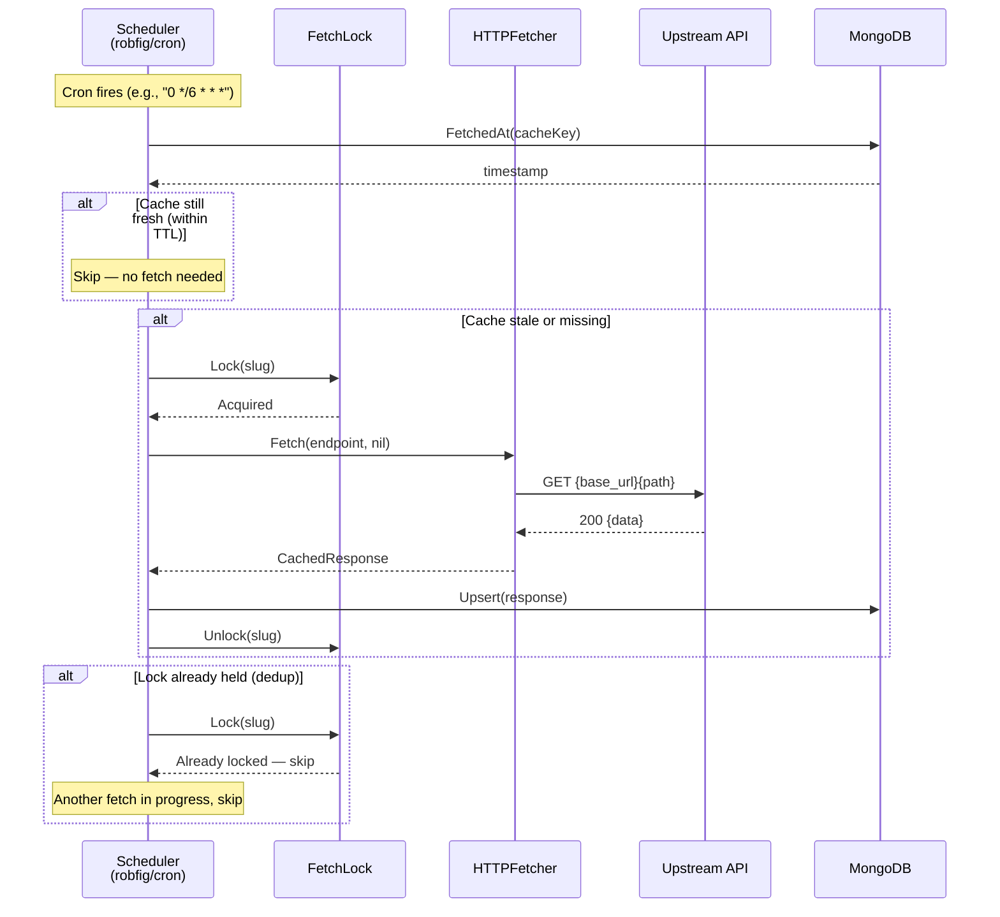
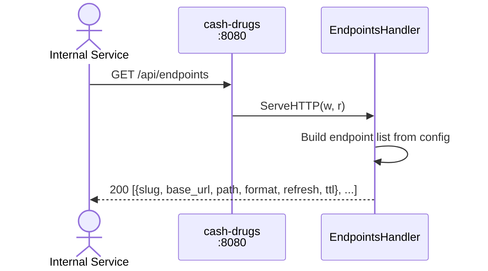
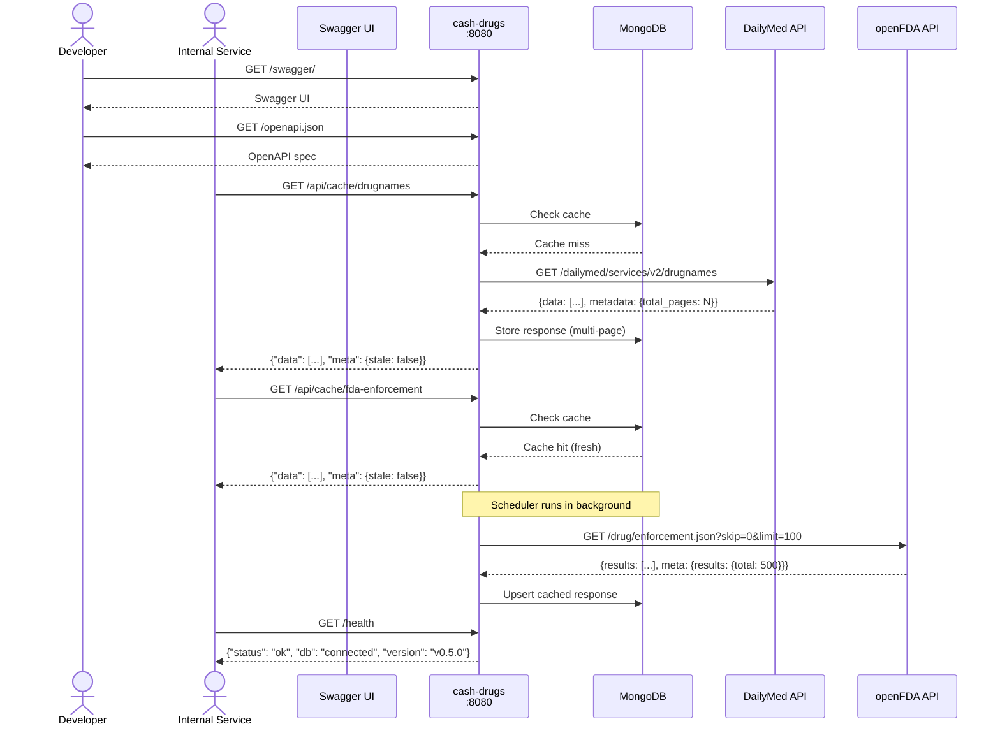

# cash-drugs Sequence Diagrams

## Cache Lookup Flow (Happy Path)

## Cache Miss — Upstream Fetch Flow

## Stale-While-Revalidate Flow

## Paginated Fetch Flow

## Scheduled Refresh Flow

## Health Check Flow

## Endpoint Discovery Flow

## System Overview

