# cash-drugs Sequence Diagrams

## Cache Lookup Flow (Happy Path)

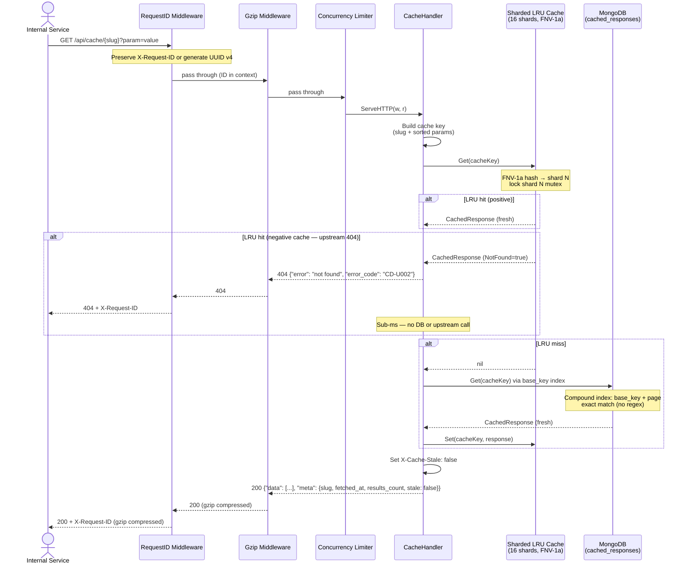
```mermaid
sequenceDiagram
    actor Client as Internal Service
    participant RID as RequestID Middleware
    participant GZ as Gzip Middleware
    participant LIM as Concurrency Limiter
    participant CH as CacheHandler
    participant LRU as Sharded LRU Cache<br/>(16 shards, FNV-1a)
    participant DB as MongoDB<br/>(cached_responses)

    Client->>RID: GET /api/cache/{slug}?param=value
    Note over RID: Preserve X-Request-ID or generate UUID v4
    RID->>GZ: pass through (ID in context)
    GZ->>LIM: pass through
    LIM->>CH: ServeHTTP(w, r)
    CH->>CH: Build cache key<br/>(slug + sorted params)
    CH->>LRU: Get(cacheKey)
    Note over LRU: FNV-1a hash → shard N<br/>lock shard N mutex
    alt LRU hit (positive)
        LRU-->>CH: CachedResponse (fresh)
    end
    alt LRU hit (negative cache — upstream 404)
        LRU-->>CH: CachedResponse (NotFound=true)
        CH-->>GZ: 404 {"error": "not found", "error_code": "CD-U002"}
        GZ-->>RID: 404
        RID-->>Client: 404 + X-Request-ID
        Note over CH: Sub-ms — no DB or upstream call
    end
    alt LRU miss
        LRU-->>CH: nil
        CH->>DB: Get(cacheKey) via base_key index
        Note over DB: Compound index: base_key + page<br/>exact match (no regex)
        DB-->>CH: CachedResponse (fresh)
        CH->>LRU: Set(cacheKey, response)
    end
    CH->>CH: Set X-Cache-Stale: false
    CH-->>GZ: 200 {"data": [...], "meta": {slug, fetched_at, results_count, stale: false}}
    GZ-->>RID: 200 (gzip compressed)
    RID-->>Client: 200 + X-Request-ID (gzip compressed)
```

## Cache Miss — Upstream Fetch Flow

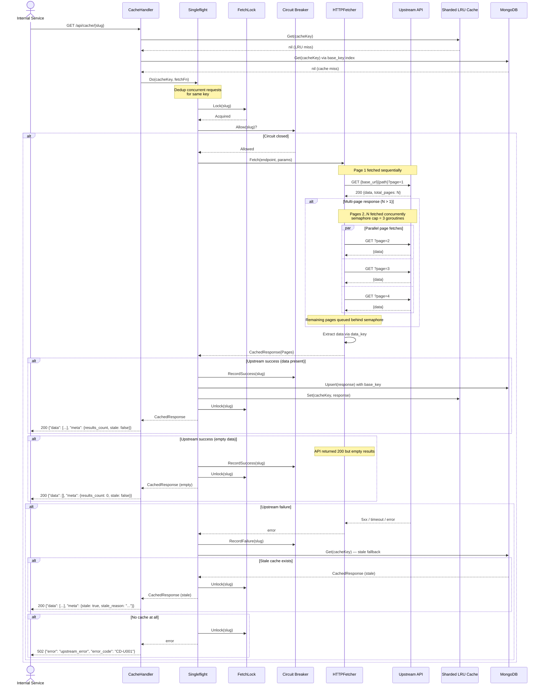
```mermaid
sequenceDiagram
    actor Client as Internal Service
    participant CH as CacheHandler
    participant SF as Singleflight
    participant FL as FetchLock
    participant CB as Circuit Breaker
    participant UF as HTTPFetcher
    participant API as Upstream API
    participant LRU as Sharded LRU Cache
    participant DB as MongoDB

    Client->>CH: GET /api/cache/{slug}
    CH->>LRU: Get(cacheKey)
    LRU-->>CH: nil (LRU miss)
    CH->>DB: Get(cacheKey) via base_key index
    DB-->>CH: nil (cache miss)

    CH->>SF: Do(cacheKey, fetchFn)
    Note over SF: Dedup concurrent requests<br/>for same key

    SF->>FL: Lock(slug)
    FL-->>SF: Acquired

    SF->>CB: Allow(slug)?
    alt Circuit closed
        CB-->>SF: Allowed
        SF->>UF: Fetch(endpoint, params)

        Note over UF,API: Page 1 fetched sequentially
        UF->>API: GET {base_url}{path}?page=1
        API-->>UF: 200 {data, total_pages: N}

        alt Multi-page response (N > 1)
            Note over UF,API: Pages 2..N fetched concurrently<br/>semaphore cap = 3 goroutines
            par Parallel page fetches
                UF->>API: GET ?page=2
                API-->>UF: {data}
            and
                UF->>API: GET ?page=3
                API-->>UF: {data}
            and
                UF->>API: GET ?page=4
                API-->>UF: {data}
            end
            Note over UF: Remaining pages queued behind semaphore
        end

        UF->>UF: Extract data via data_key
        UF-->>SF: CachedResponse{Pages}

        alt Upstream success (data present)
            SF->>CB: RecordSuccess(slug)
            SF->>DB: Upsert(response) with base_key
            SF->>LRU: Set(cacheKey, response)
            SF->>FL: Unlock(slug)
            SF-->>CH: CachedResponse
            CH-->>Client: 200 {"data": [...], "meta": {results_count, stale: false}}
        end

        alt Upstream success (empty data)
            Note over UF: API returned 200 but empty results
            SF->>CB: RecordSuccess(slug)
            SF->>FL: Unlock(slug)
            SF-->>CH: CachedResponse (empty)
            CH-->>Client: 200 {"data": [], "meta": {results_count: 0, stale: false}}
        end

        alt Upstream failure
            API-->>UF: 5xx / timeout / error
            UF-->>SF: error
            SF->>CB: RecordFailure(slug)
            SF->>DB: Get(cacheKey) — stale fallback
            alt Stale cache exists
                DB-->>SF: CachedResponse (stale)
                SF->>FL: Unlock(slug)
                SF-->>CH: CachedResponse (stale)
                CH-->>Client: 200 {"data": [...], "meta": {stale: true, stale_reason: "..."}}
            end
            alt No cache at all
                SF->>FL: Unlock(slug)
                SF-->>CH: error
                CH-->>Client: 502 {"error": "upstream_error", "error_code": "CD-U001"}
            end
        end
    end
```

## Stale-While-Revalidate Flow

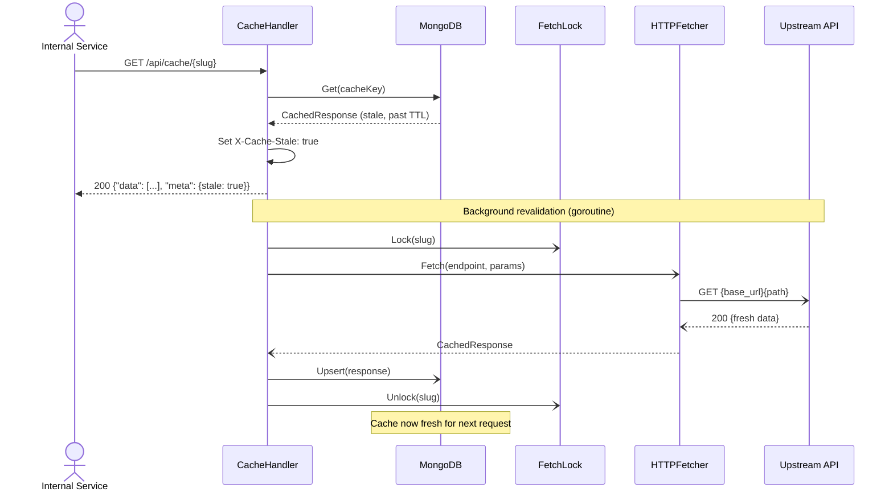
```mermaid
sequenceDiagram
    actor Client as Internal Service
    participant CH as CacheHandler
    participant DB as MongoDB
    participant FL as FetchLock
    participant UF as HTTPFetcher
    participant API as Upstream API

    Client->>CH: GET /api/cache/{slug}
    CH->>DB: Get(cacheKey)
    DB-->>CH: CachedResponse (stale, past TTL)

    CH->>CH: Set X-Cache-Stale: true
    CH-->>Client: 200 {"data": [...], "meta": {stale: true}}

    Note over CH,API: Background revalidation (goroutine)
    CH-)FL: Lock(slug)
    CH-)UF: Fetch(endpoint, params)
    UF-)API: GET {base_url}{path}
    API--)UF: 200 {fresh data}
    UF--)CH: CachedResponse
    CH-)DB: Upsert(response)
    CH-)FL: Unlock(slug)
    Note over DB: Cache now fresh for next request
```

## Concurrency Limiter Flow

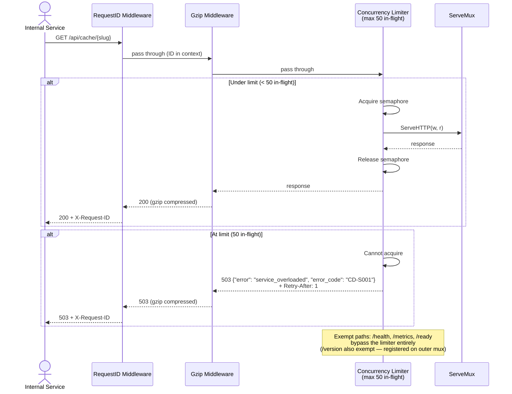
```mermaid
sequenceDiagram
    actor Client as Internal Service
    participant RID as RequestID Middleware
    participant GZ as Gzip Middleware
    participant LIM as Concurrency Limiter<br/>(max 50 in-flight)
    participant MUX as ServeMux

    Client->>RID: GET /api/cache/{slug}
    RID->>GZ: pass through (ID in context)
    GZ->>LIM: pass through

    alt Under limit (< 50 in-flight)
        LIM->>LIM: Acquire semaphore
        LIM->>MUX: ServeHTTP(w, r)
        MUX-->>LIM: response
        LIM->>LIM: Release semaphore
        LIM-->>GZ: response
        GZ-->>RID: 200 (gzip compressed)
        RID-->>Client: 200 + X-Request-ID
    end

    alt At limit (50 in-flight)
        LIM->>LIM: Cannot acquire
        LIM-->>GZ: 503 {"error": "service_overloaded", "error_code": "CD-S001"}<br/>+ Retry-After: 1
        GZ-->>RID: 503 (gzip compressed)
        RID-->>Client: 503 + X-Request-ID
    end

    Note over LIM: Exempt paths: /health, /metrics, /ready<br/>bypass the limiter entirely<br/>(/version also exempt — registered on outer mux)
```

## Circuit Breaker Flow

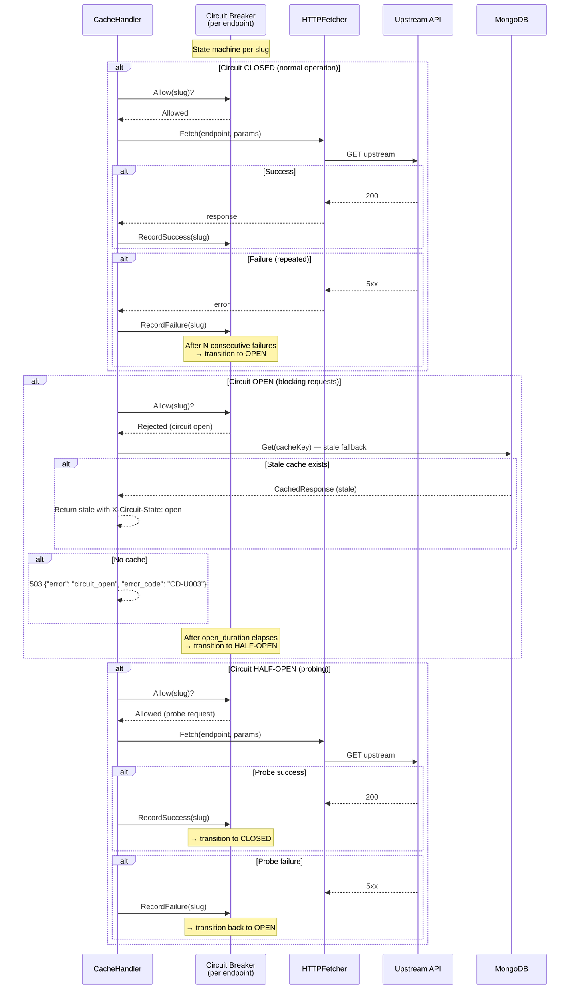
```mermaid
sequenceDiagram
    participant CH as CacheHandler
    participant CB as Circuit Breaker<br/>(per endpoint)
    participant UF as HTTPFetcher
    participant API as Upstream API
    participant DB as MongoDB

    Note over CB: State machine per slug

    alt Circuit CLOSED (normal operation)
        CH->>CB: Allow(slug)?
        CB-->>CH: Allowed
        CH->>UF: Fetch(endpoint, params)
        UF->>API: GET upstream
        alt Success
            API-->>UF: 200
            UF-->>CH: response
            CH->>CB: RecordSuccess(slug)
        end
        alt Failure (repeated)
            API-->>UF: 5xx
            UF-->>CH: error
            CH->>CB: RecordFailure(slug)
            Note over CB: After N consecutive failures<br/>→ transition to OPEN
        end
    end

    alt Circuit OPEN (blocking requests)
        CH->>CB: Allow(slug)?
        CB-->>CH: Rejected (circuit open)
        CH->>DB: Get(cacheKey) — stale fallback
        alt Stale cache exists
            DB-->>CH: CachedResponse (stale)
            CH-->>CH: Return stale with X-Circuit-State: open
        end
        alt No cache
            CH-->>CH: 503 {"error": "circuit_open", "error_code": "CD-U003"}
        end
        Note over CB: After open_duration elapses<br/>→ transition to HALF-OPEN
    end

    alt Circuit HALF-OPEN (probing)
        CH->>CB: Allow(slug)?
        CB-->>CH: Allowed (probe request)
        CH->>UF: Fetch(endpoint, params)
        UF->>API: GET upstream
        alt Probe success
            API-->>UF: 200
            CH->>CB: RecordSuccess(slug)
            Note over CB: → transition to CLOSED
        end
        alt Probe failure
            API-->>UF: 5xx
            CH->>CB: RecordFailure(slug)
            Note over CB: → transition back to OPEN
        end
    end
```

## Force-Refresh Cooldown Flow

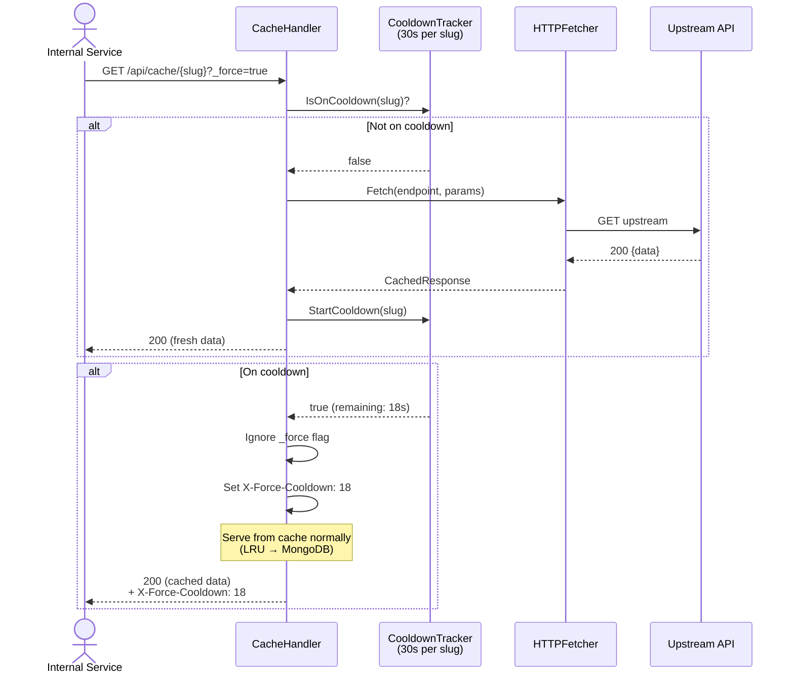
```mermaid
sequenceDiagram
    actor Client as Internal Service
    participant CH as CacheHandler
    participant CD as CooldownTracker<br/>(30s per slug)
    participant UF as HTTPFetcher
    participant API as Upstream API

    Client->>CH: GET /api/cache/{slug}?_force=true

    CH->>CD: IsOnCooldown(slug)?

    alt Not on cooldown
        CD-->>CH: false
        CH->>UF: Fetch(endpoint, params)
        UF->>API: GET upstream
        API-->>UF: 200 {data}
        UF-->>CH: CachedResponse
        CH->>CD: StartCooldown(slug)
        CH-->>Client: 200 (fresh data)
    end

    alt On cooldown
        CD-->>CH: true (remaining: 18s)
        CH->>CH: Ignore _force flag
        CH->>CH: Set X-Force-Cooldown: 18
        Note over CH: Serve from cache normally<br/>(LRU → MongoDB)
        CH-->>Client: 200 (cached data)<br/>+ X-Force-Cooldown: 18
    end
```

## Container System Metrics Flow

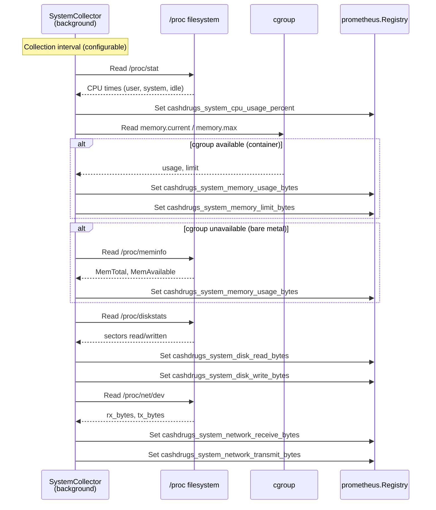
```mermaid
sequenceDiagram
    participant SC as SystemCollector<br/>(background)
    participant PROC as /proc filesystem
    participant CG as cgroup
    participant REG as prometheus.Registry

    Note over SC: Collection interval (configurable)

    SC->>PROC: Read /proc/stat
    PROC-->>SC: CPU times (user, system, idle)
    SC->>REG: Set cashdrugs_system_cpu_usage_percent

    SC->>CG: Read memory.current / memory.max
    alt cgroup available (container)
        CG-->>SC: usage, limit
        SC->>REG: Set cashdrugs_system_memory_usage_bytes
        SC->>REG: Set cashdrugs_system_memory_limit_bytes
    end
    alt cgroup unavailable (bare metal)
        SC->>PROC: Read /proc/meminfo
        PROC-->>SC: MemTotal, MemAvailable
        SC->>REG: Set cashdrugs_system_memory_usage_bytes
    end

    SC->>PROC: Read /proc/diskstats
    PROC-->>SC: sectors read/written
    SC->>REG: Set cashdrugs_system_disk_read_bytes
    SC->>REG: Set cashdrugs_system_disk_write_bytes

    SC->>PROC: Read /proc/net/dev
    PROC-->>SC: rx_bytes, tx_bytes
    SC->>REG: Set cashdrugs_system_network_receive_bytes
    SC->>REG: Set cashdrugs_system_network_transmit_bytes
```

## Paginated Fetch Flow (Parallel)

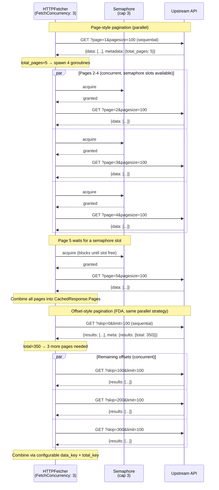
```mermaid
sequenceDiagram
    participant UF as HTTPFetcher<br/>(FetchConcurrency: 3)
    participant SEM as Semaphore<br/>(cap 3)
    participant API as Upstream API

    Note over UF,API: Page-style pagination (parallel)
    UF->>API: GET ?page=1&pagesize=100 (sequential)
    API-->>UF: {data: [...], metadata: {total_pages: 5}}
    Note over UF: total_pages=5 → spawn 4 goroutines

    par Pages 2-4 (concurrent, semaphore slots available)
        UF->>SEM: acquire
        SEM-->>UF: granted
        UF->>API: GET ?page=2&pagesize=100
        API-->>UF: {data: [...]}
    and
        UF->>SEM: acquire
        SEM-->>UF: granted
        UF->>API: GET ?page=3&pagesize=100
        API-->>UF: {data: [...]}
    and
        UF->>SEM: acquire
        SEM-->>UF: granted
        UF->>API: GET ?page=4&pagesize=100
        API-->>UF: {data: [...]}
    end

    Note over UF,SEM: Page 5 waits for a semaphore slot
    UF->>SEM: acquire (blocks until slot free)
    SEM-->>UF: granted
    UF->>API: GET ?page=5&pagesize=100
    API-->>UF: {data: [...]}

    Note over UF: Combine all pages into CachedResponse.Pages

    Note over UF,API: Offset-style pagination (FDA, same parallel strategy)
    UF->>API: GET ?skip=0&limit=100 (sequential)
    API-->>UF: {results: [...], meta: {results: {total: 350}}}
    Note over UF: total=350 → 3 more pages needed

    par Remaining offsets (concurrent)
        UF->>API: GET ?skip=100&limit=100
        API-->>UF: {results: [...]}
    and
        UF->>API: GET ?skip=200&limit=100
        API-->>UF: {results: [...]}
    and
        UF->>API: GET ?skip=300&limit=100
        API-->>UF: {results: [...]}
    end

    Note over UF: Combine via configurable data_key + total_key
```

## Scheduled Refresh Flow

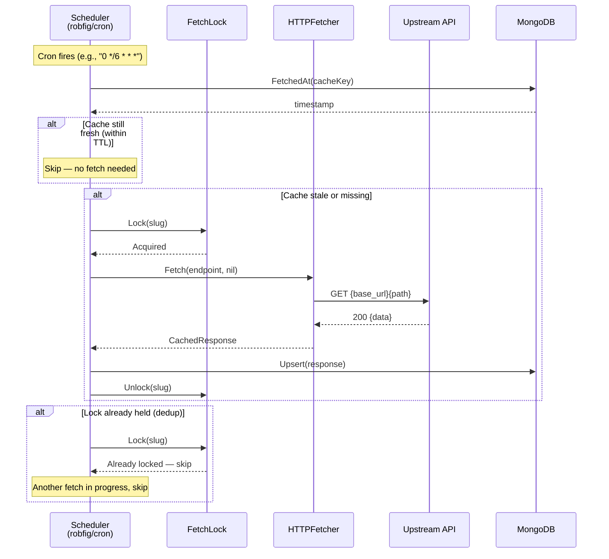
```mermaid
sequenceDiagram
    participant CRON as Scheduler<br/>(robfig/cron)
    participant FL as FetchLock
    participant UF as HTTPFetcher
    participant API as Upstream API
    participant DB as MongoDB

    Note over CRON: Cron fires (e.g., "0 */6 * * *")
    CRON->>DB: FetchedAt(cacheKey)
    DB-->>CRON: timestamp

    alt Cache still fresh (within TTL)
        Note over CRON: Skip — no fetch needed
    end

    alt Cache stale or missing
        CRON->>FL: Lock(slug)
        FL-->>CRON: Acquired
        CRON->>UF: Fetch(endpoint, nil)
        UF->>API: GET {base_url}{path}
        API-->>UF: 200 {data}
        UF-->>CRON: CachedResponse
        CRON->>DB: Upsert(response)
        CRON->>FL: Unlock(slug)
    end

    alt Lock already held (dedup)
        CRON->>FL: Lock(slug)
        FL-->>CRON: Already locked — skip
        Note over CRON: Another fetch in progress, skip
    end
```

## Health Check Flow

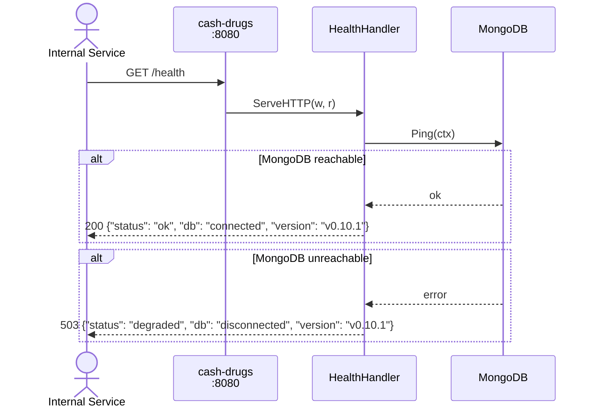
```mermaid
sequenceDiagram
    actor Client as Internal Service
    participant GW as cash-drugs<br/>:8080
    participant HC as HealthHandler
    participant DB as MongoDB

    Client->>GW: GET /health
    GW->>HC: ServeHTTP(w, r)
    HC->>DB: Ping(ctx)

    alt MongoDB reachable
        DB-->>HC: ok
        HC-->>Client: 200 {"status": "ok", "db": "connected", "version": "v0.10.1"}
    end

    alt MongoDB unreachable
        DB-->>HC: error
        HC-->>Client: 503 {"status": "degraded", "db": "disconnected", "version": "v0.10.1"}
    end
```

## Endpoint Discovery Flow

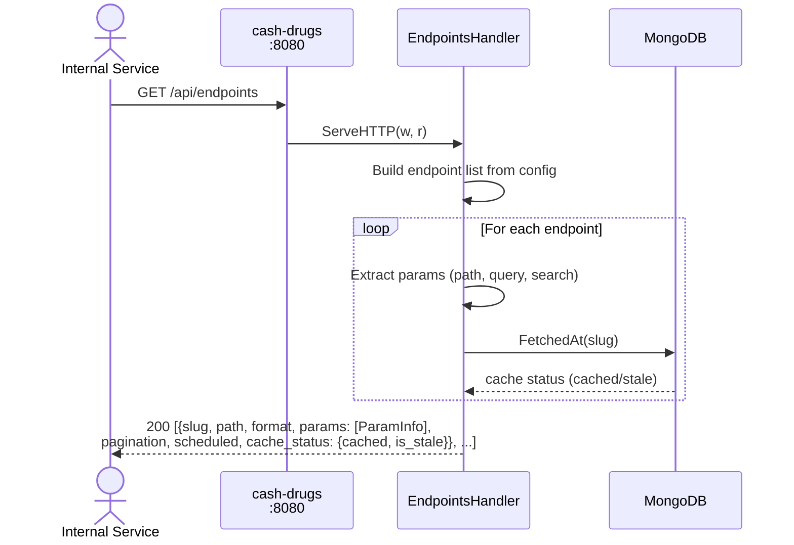
```mermaid
sequenceDiagram
    actor Client as Internal Service
    participant GW as cash-drugs<br/>:8080
    participant EH as EndpointsHandler
    participant DB as MongoDB

    Client->>GW: GET /api/endpoints
    GW->>EH: ServeHTTP(w, r)
    EH->>EH: Build endpoint list from config
    loop For each endpoint
        EH->>EH: Extract params (path, query, search)
        EH->>DB: FetchedAt(slug)
        DB-->>EH: cache status (cached/stale)
    end
    EH-->>Client: 200 [{slug, path, format, params: [ParamInfo],<br/>pagination, scheduled, cache_status: {cached, is_stale}}, ...]
```

## Prometheus Metrics Flow

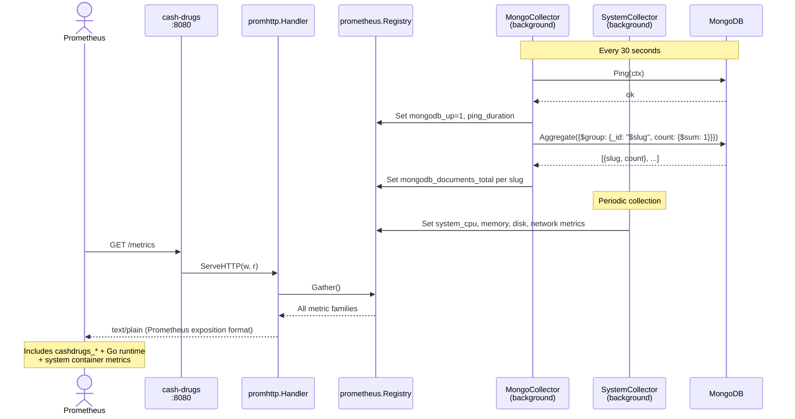
```mermaid
sequenceDiagram
    actor Prom as Prometheus
    participant GW as cash-drugs<br/>:8080
    participant MH as promhttp.Handler
    participant REG as prometheus.Registry
    participant MC as MongoCollector<br/>(background)
    participant SC as SystemCollector<br/>(background)
    participant DB as MongoDB

    Note over MC,DB: Every 30 seconds
    MC->>DB: Ping(ctx)
    DB-->>MC: ok
    MC->>REG: Set mongodb_up=1, ping_duration
    MC->>DB: Aggregate({$group: {_id: "$slug", count: {$sum: 1}}})
    DB-->>MC: [{slug, count}, ...]
    MC->>REG: Set mongodb_documents_total per slug

    Note over SC: Periodic collection
    SC->>REG: Set system_cpu, memory, disk, network metrics

    Prom->>GW: GET /metrics
    GW->>MH: ServeHTTP(w, r)
    MH->>REG: Gather()
    REG-->>MH: All metric families
    MH-->>Prom: text/plain (Prometheus exposition format)
    Note over Prom: Includes cashdrugs_* + Go runtime<br/>+ system container metrics
```

## Version Endpoint Flow

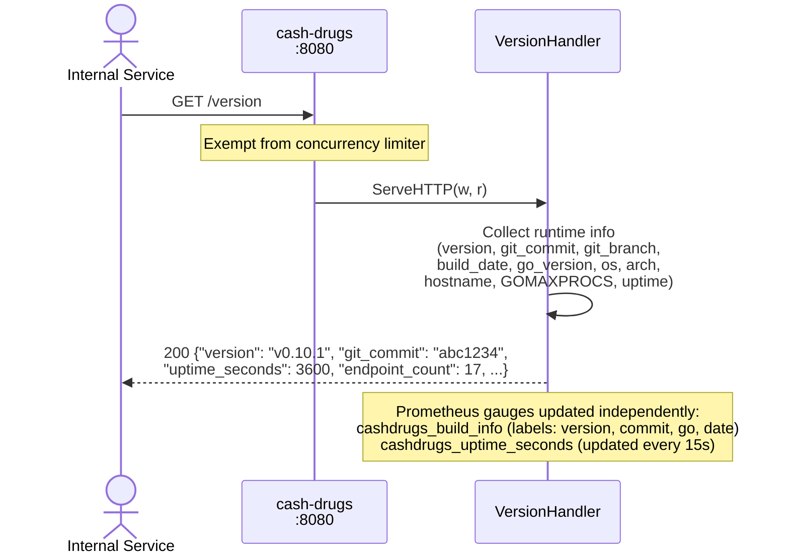
```mermaid
sequenceDiagram
    actor Client as Internal Service
    participant GW as cash-drugs<br/>:8080
    participant VH as VersionHandler

    Client->>GW: GET /version
    Note over GW: Exempt from concurrency limiter
    GW->>VH: ServeHTTP(w, r)
    VH->>VH: Collect runtime info<br/>(version, git_commit, git_branch,<br/>build_date, go_version, os, arch,<br/>hostname, GOMAXPROCS, uptime)
    VH-->>Client: 200 {"version": "v0.10.1", "git_commit": "abc1234",<br/>"uptime_seconds": 3600, "endpoint_count": 17, ...}

    Note over VH: Prometheus gauges updated independently:<br/>cashdrugs_build_info (labels: version, commit, go, date)<br/>cashdrugs_uptime_seconds (updated every 15s)
```

## Empty Upstream Result Flow

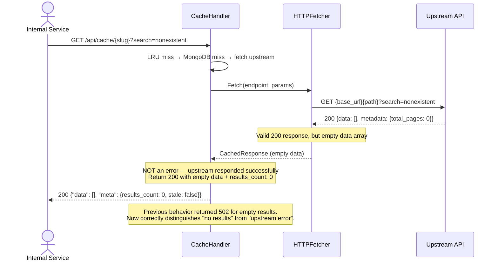
```mermaid
sequenceDiagram
    actor Client as Internal Service
    participant CH as CacheHandler
    participant UF as HTTPFetcher
    participant API as Upstream API

    Client->>CH: GET /api/cache/{slug}?search=nonexistent
    CH->>CH: LRU miss → MongoDB miss → fetch upstream

    CH->>UF: Fetch(endpoint, params)
    UF->>API: GET {base_url}{path}?search=nonexistent
    API-->>UF: 200 {data: [], metadata: {total_pages: 0}}
    Note over UF: Valid 200 response, but empty data array

    UF-->>CH: CachedResponse (empty data)

    Note over CH: NOT an error — upstream responded successfully<br/>Return 200 with empty data + results_count: 0
    CH-->>Client: 200 {"data": [], "meta": {results_count: 0, stale: false}}

    Note over CH: Previous behavior returned 502 for empty results.<br/>Now correctly distinguishes "no results" from "upstream error".
```

## RxNorm Lookup Flow

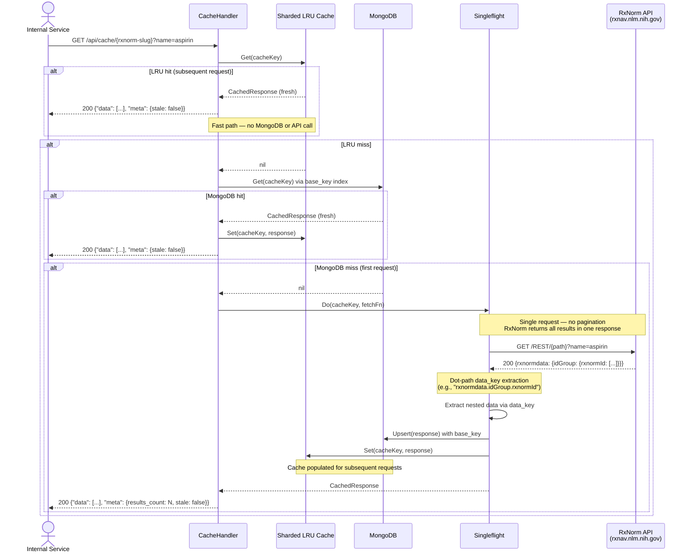
```mermaid
sequenceDiagram
    actor Client as Internal Service
    participant CH as CacheHandler
    participant LRU as Sharded LRU Cache
    participant DB as MongoDB
    participant SF as Singleflight
    participant RX as RxNorm API<br/>(rxnav.nlm.nih.gov)

    Client->>CH: GET /api/cache/{rxnorm-slug}?name=aspirin

    CH->>LRU: Get(cacheKey)
    alt LRU hit (subsequent request)
        LRU-->>CH: CachedResponse (fresh)
        CH-->>Client: 200 {"data": [...], "meta": {stale: false}}
        Note over LRU,CH: Fast path — no MongoDB or API call
    end

    alt LRU miss
        LRU-->>CH: nil
        CH->>DB: Get(cacheKey) via base_key index
        alt MongoDB hit
            DB-->>CH: CachedResponse (fresh)
            CH->>LRU: Set(cacheKey, response)
            CH-->>Client: 200 {"data": [...], "meta": {stale: false}}
        end

        alt MongoDB miss (first request)
            DB-->>CH: nil
            CH->>SF: Do(cacheKey, fetchFn)
            Note over SF,RX: Single request — no pagination<br/>RxNorm returns all results in one response

            SF->>RX: GET /REST/{path}?name=aspirin
            RX-->>SF: 200 {rxnormdata: {idGroup: {rxnormId: [...]}}}

            Note over SF: Dot-path data_key extraction<br/>(e.g., "rxnormdata.idGroup.rxnormId")
            SF->>SF: Extract nested data via data_key

            SF->>DB: Upsert(response) with base_key
            SF->>LRU: Set(cacheKey, response)
            Note over LRU,DB: Cache populated for subsequent requests

            SF-->>CH: CachedResponse
            CH-->>Client: 200 {"data": [...], "meta": {results_count: N, stale: false}}
        end
    end
```

## Readiness Check Flow

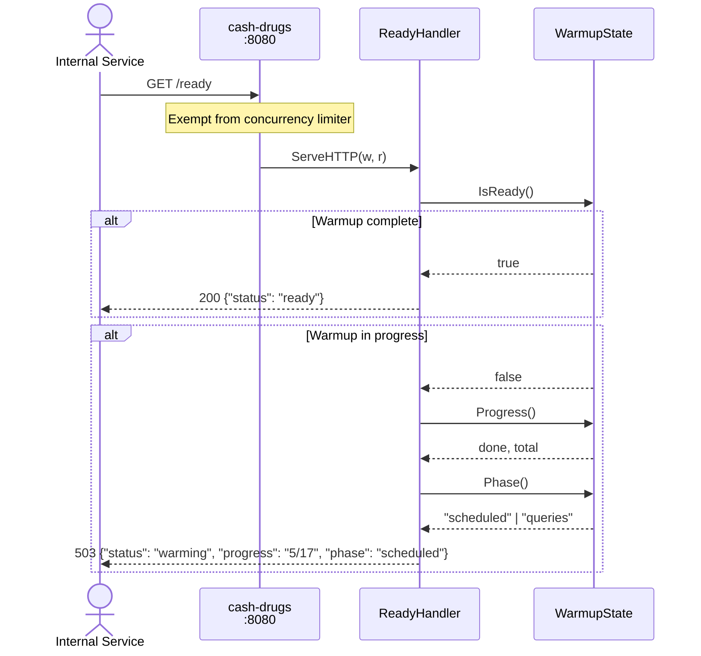
```mermaid
sequenceDiagram
    actor Client as Internal Service
    participant GW as cash-drugs<br/>:8080
    participant RH as ReadyHandler
    participant WS as WarmupState

    Client->>GW: GET /ready
    Note over GW: Exempt from concurrency limiter
    GW->>RH: ServeHTTP(w, r)
    RH->>WS: IsReady()

    alt Warmup complete
        WS-->>RH: true
        RH-->>Client: 200 {"status": "ready"}
    end

    alt Warmup in progress
        WS-->>RH: false
        RH->>WS: Progress()
        WS-->>RH: done, total
        RH->>WS: Phase()
        WS-->>RH: "scheduled" | "queries"
        RH-->>Client: 503 {"status": "warming", "progress": "5/17", "phase": "scheduled"}
    end
```

## Cache Warmup Flow

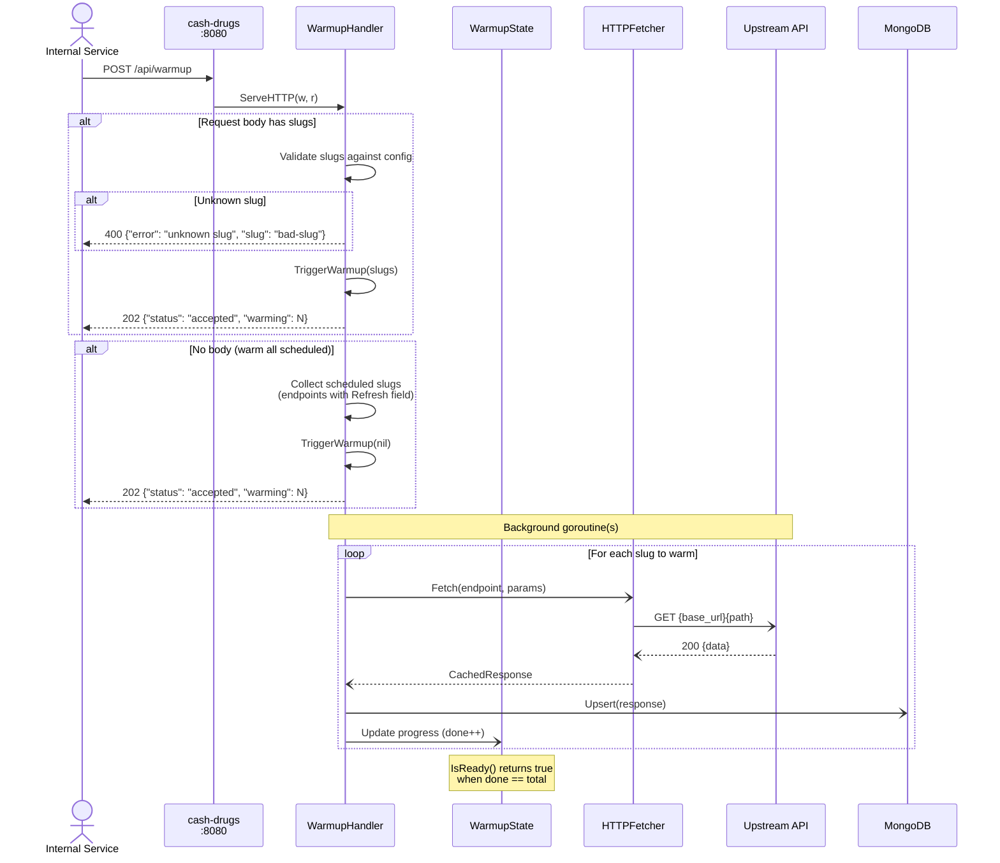
```mermaid
sequenceDiagram
    actor Client as Internal Service
    participant GW as cash-drugs<br/>:8080
    participant WH as WarmupHandler
    participant WS as WarmupState
    participant UF as HTTPFetcher
    participant API as Upstream API
    participant DB as MongoDB

    Client->>GW: POST /api/warmup
    GW->>WH: ServeHTTP(w, r)

    alt Request body has slugs
        WH->>WH: Validate slugs against config
        alt Unknown slug
            WH-->>Client: 400 {"error": "unknown slug", "slug": "bad-slug"}
        end
        WH->>WH: TriggerWarmup(slugs)
        WH-->>Client: 202 {"status": "accepted", "warming": N}
    end

    alt No body (warm all scheduled)
        WH->>WH: Collect scheduled slugs<br/>(endpoints with Refresh field)
        WH->>WH: TriggerWarmup(nil)
        WH-->>Client: 202 {"status": "accepted", "warming": N}
    end

    Note over WH,API: Background goroutine(s)
    loop For each slug to warm
        WH-)UF: Fetch(endpoint, params)
        UF-)API: GET {base_url}{path}
        API--)UF: 200 {data}
        UF--)WH: CachedResponse
        WH-)DB: Upsert(response)
        WH-)WS: Update progress (done++)
    end
    Note over WS: IsReady() returns true<br/>when done == total
```

## Upstream 404 / Negative Cache Flow

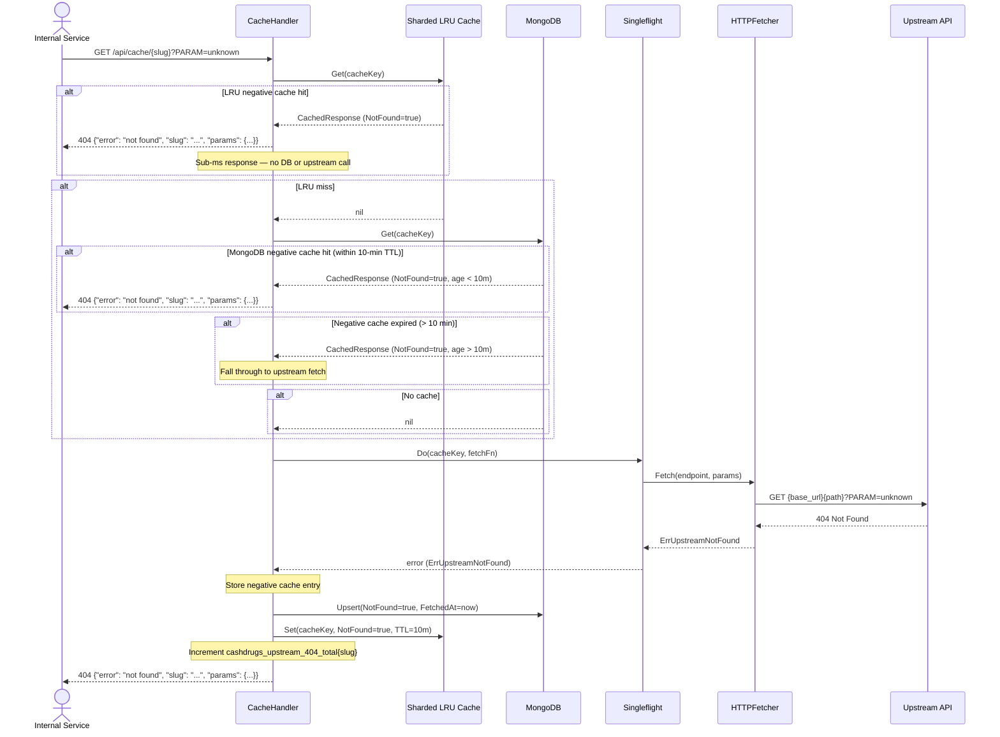
```mermaid
sequenceDiagram
    actor Client as Internal Service
    participant CH as CacheHandler
    participant LRU as Sharded LRU Cache
    participant DB as MongoDB
    participant SF as Singleflight
    participant UF as HTTPFetcher
    participant API as Upstream API

    Client->>CH: GET /api/cache/{slug}?PARAM=unknown

    CH->>LRU: Get(cacheKey)
    alt LRU negative cache hit
        LRU-->>CH: CachedResponse (NotFound=true)
        CH-->>Client: 404 {"error": "not found", "slug": "...", "params": {...}}
        Note over CH: Sub-ms response — no DB or upstream call
    end

    alt LRU miss
        LRU-->>CH: nil
        CH->>DB: Get(cacheKey)
        alt MongoDB negative cache hit (within 10-min TTL)
            DB-->>CH: CachedResponse (NotFound=true, age < 10m)
            CH-->>Client: 404 {"error": "not found", "slug": "...", "params": {...}}
        end
        alt Negative cache expired (> 10 min)
            DB-->>CH: CachedResponse (NotFound=true, age > 10m)
            Note over CH: Fall through to upstream fetch
        end
        alt No cache
            DB-->>CH: nil
        end
    end

    CH->>SF: Do(cacheKey, fetchFn)
    SF->>UF: Fetch(endpoint, params)
    UF->>API: GET {base_url}{path}?PARAM=unknown
    API-->>UF: 404 Not Found

    UF-->>SF: ErrUpstreamNotFound
    SF-->>CH: error (ErrUpstreamNotFound)

    Note over CH: Store negative cache entry
    CH->>DB: Upsert(NotFound=true, FetchedAt=now)
    CH->>LRU: Set(cacheKey, NotFound=true, TTL=10m)
    Note over CH: Increment cashdrugs_upstream_404_total{slug}

    CH-->>Client: 404 {"error": "not found", "slug": "...", "params": {...}}
```

## Cache Status Endpoint Flow

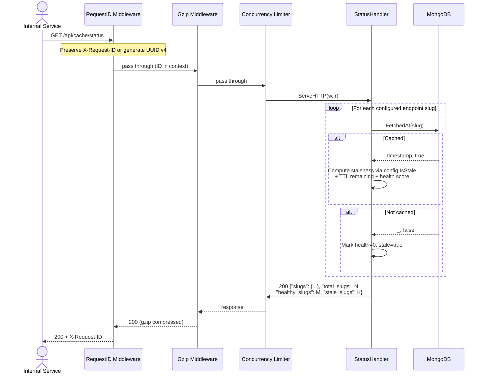
```mermaid
sequenceDiagram
    actor Client as Internal Service
    participant RID as RequestID Middleware
    participant GZ as Gzip Middleware
    participant LIM as Concurrency Limiter
    participant SH as StatusHandler
    participant DB as MongoDB

    Client->>RID: GET /api/cache/status
    Note over RID: Preserve X-Request-ID or generate UUID v4
    RID->>GZ: pass through (ID in context)
    GZ->>LIM: pass through
    LIM->>SH: ServeHTTP(w, r)

    loop For each configured endpoint slug
        SH->>DB: FetchedAt(slug)
        alt Cached
            DB-->>SH: timestamp, true
            SH->>SH: Compute staleness via config.IsStale<br/>+ TTL remaining + health score
        end
        alt Not cached
            DB-->>SH: _, false
            SH->>SH: Mark health=0, stale=true
        end
    end

    SH-->>LIM: 200 {"slugs": {...}, "total_slugs": N,<br/>"healthy_slugs": M, "stale_slugs": K}
    LIM-->>GZ: response
    GZ-->>RID: 200 (gzip compressed)
    RID-->>Client: 200 + X-Request-ID
```

## Request Correlation ID Flow

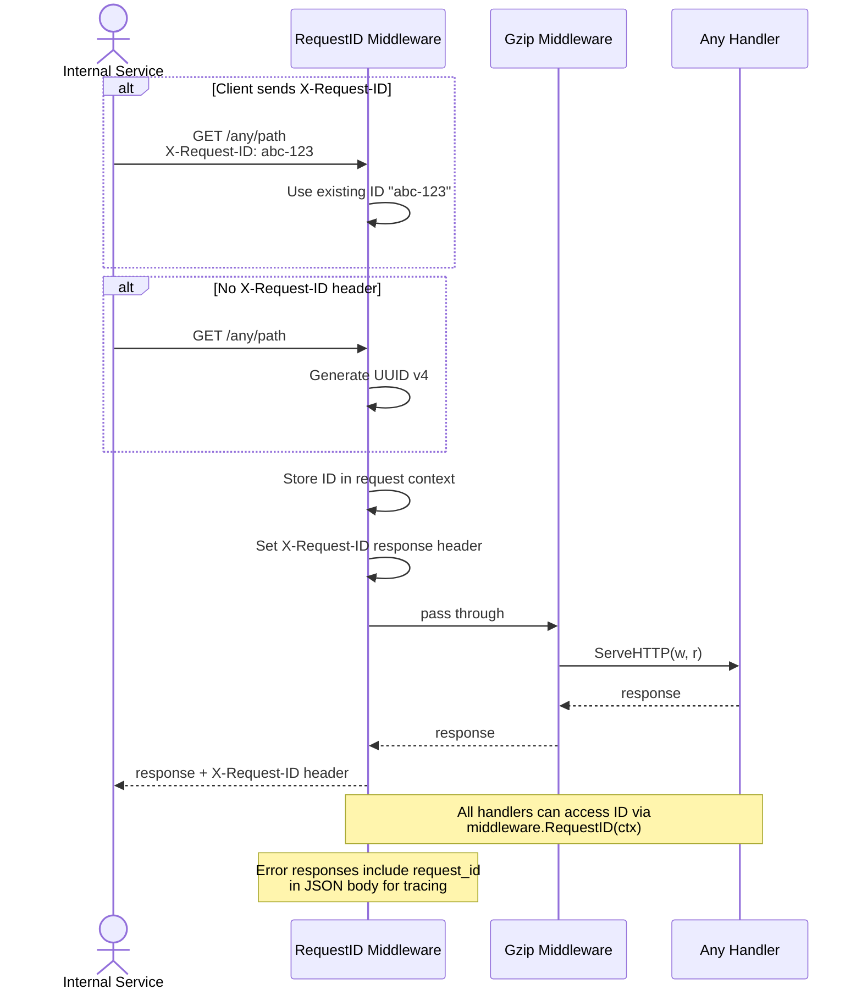
```mermaid
sequenceDiagram
    actor Client as Internal Service
    participant RID as RequestID Middleware
    participant GZ as Gzip Middleware
    participant Handler as Any Handler

    alt Client sends X-Request-ID
        Client->>RID: GET /any/path<br/>X-Request-ID: abc-123
        RID->>RID: Use existing ID "abc-123"
    end

    alt No X-Request-ID header
        Client->>RID: GET /any/path
        RID->>RID: Generate UUID v4
    end

    RID->>RID: Store ID in request context
    RID->>RID: Set X-Request-ID response header
    RID->>GZ: pass through
    GZ->>Handler: ServeHTTP(w, r)
    Handler-->>GZ: response
    GZ-->>RID: response
    RID-->>Client: response + X-Request-ID header

    Note over RID,Handler: All handlers can access ID via<br/>middleware.RequestID(ctx)
    Note over RID: Error responses include request_id<br/>in JSON body for tracing
```

## Per-Slug Metadata Flow

```mermaid
sequenceDiagram
    actor Client as Internal Service
    participant RID as RequestID Middleware
    participant GZ as Gzip Middleware
    participant LIM as Concurrency Limiter
    participant AM as AllowMethods
    participant MH as MetaHandler
    participant CB as Circuit Breaker
    participant DB as MongoDB

    Client->>RID: GET /api/cache/{slug}/_meta
    Note over RID: Preserve X-Request-ID or generate UUID v4
    RID->>GZ: pass through (ID in context)
    GZ->>LIM: pass through
    LIM->>AM: pass through (GET allowed)
    AM->>MH: ServeHTTP(w, r)

    MH->>MH: Extract slug from path

    alt Slug not in config
        MH-->>Client: 404 {"error": "endpoint not configured", "error_code": "CD-H001"}
    end

    MH->>CB: State(slug)
    CB-->>MH: closed | open | half-open

    MH->>DB: FetchedAt(slug)
    alt Cached
        DB-->>MH: timestamp, true
        MH->>MH: Compute staleness, TTL remaining
        MH->>DB: Get(slug)
        DB-->>MH: CachedResponse
        MH->>MH: Count pages + records
    end
    alt Not cached
        DB-->>MH: _, false
        MH->>MH: is_stale=true, ttl_remaining="0s"
    end

    MH-->>GZ: 200 {"slug", "last_refreshed", "ttl_remaining",<br/>"is_stale", "page_count", "record_count",<br/>"circuit_state", "has_schedule", "has_params"}
    GZ-->>RID: 200 (gzip compressed)
    RID-->>Client: 200 + X-Request-ID
```

## Bulk Cache Lookup Flow

```mermaid
sequenceDiagram
    actor Client as Internal Service
    participant RID as RequestID Middleware
    participant GZ as Gzip Middleware
    participant LIM as Concurrency Limiter
    participant AM as AllowMethods
    participant BH as BulkHandler
    participant LRU as Sharded LRU Cache
    participant DB as MongoDB

    Client->>RID: POST /api/cache/{slug}/bulk
    Note over RID: Preserve X-Request-ID or generate UUID v4
    RID->>GZ: pass through (ID in context)
    GZ->>LIM: pass through
    LIM->>AM: pass through (POST allowed for /bulk)
    AM->>BH: ServeHTTP(w, r)

    BH->>BH: Validate slug in config
    alt Slug not in config
        BH-->>Client: 404 {"error_code": "CD-H001"}
    end

    BH->>BH: Decode JSON body
    alt Invalid body
        BH-->>Client: 400 {"error_code": "CD-H005"}
    end
    alt Batch > 100 queries
        BH-->>Client: 400 {"error_code": "CD-H005"}
    end

    Note over BH: Record BulkRequestSize metric

    par Concurrent lookups (semaphore cap=10)
        BH->>LRU: Get(cacheKey₁)
        alt LRU hit
            LRU-->>BH: CachedResponse → status: "hit"
        end
        alt LRU miss
            LRU-->>BH: nil
            BH->>DB: Get(cacheKey₁)
            alt DB hit
                DB-->>BH: CachedResponse → status: "hit"
            end
            alt DB miss
                DB-->>BH: nil → status: "miss"
            end
        end
    and
        BH->>LRU: Get(cacheKey₂)
        LRU-->>BH: result
    and
        BH->>LRU: Get(cacheKeyₙ)
        LRU-->>BH: result
    end

    Note over BH: Tally hits/misses/errors<br/>Record BulkRequestDuration metric

    BH-->>GZ: 200 {"slug", "results": [...],<br/>"total_queries", "hits", "misses", "errors", "duration_ms"}
    GZ-->>RID: 200 (gzip compressed)
    RID-->>Client: 200 + X-Request-ID

    Note over BH: Cache-only — does NOT trigger upstream fetches
```

## Test-Fetch Dry-Run Flow

```mermaid
sequenceDiagram
    actor Client as Internal Service
    participant RID as RequestID Middleware
    participant GZ as Gzip Middleware
    participant LIM as Concurrency Limiter
    participant AM as AllowMethods
    participant TF as TestFetchHandler
    participant UF as HTTPFetcher
    participant API as Upstream API

    Client->>RID: POST /api/test-fetch
    Note over RID: Preserve X-Request-ID or generate UUID v4
    RID->>GZ: pass through (ID in context)
    GZ->>LIM: pass through
    LIM->>AM: pass through (POST allowed for /api/test-fetch)
    AM->>TF: ServeHTTP(w, r)

    TF->>TF: Decode JSON body (1MB limit)
    alt Invalid JSON
        TF-->>Client: 400 {"error_code": "CD-H005"}
    end
    alt Missing required fields (base_url, path, format)
        TF-->>Client: 400 {"error_code": "CD-H005"}
    end

    TF->>TF: Build temporary Endpoint<br/>(pagination forced to 1 page)
    TF->>UF: Fetch(endpoint, nil)
    UF->>API: GET {base_url}{path}

    alt Upstream success
        API-->>UF: 200 {data}
        UF-->>TF: CachedResponse
        TF->>TF: Build preview (first 5 items)<br/>+ estimate page count
        TF-->>GZ: 200 {"success": true, "status_code", "data_preview",<br/>"total_results", "page_count_estimate", "fetch_duration_ms"}
        GZ-->>RID: 200 (gzip compressed)
        RID-->>Client: 200 + X-Request-ID
    end

    alt Upstream failure
        API-->>UF: error / timeout / 4xx / 5xx
        UF-->>TF: error
        TF-->>GZ: 200 {"success": false, "error", "error_code": "CD-U001"}
        GZ-->>RID: 200 (gzip compressed)
        RID-->>Client: 200 + X-Request-ID
    end

    Note over TF: Does NOT cache results<br/>Does NOT use circuit breaker or cooldown
```

## Parameter Validation Flow (400)

```mermaid
sequenceDiagram
    actor Client as Internal Service
    participant RID as RequestID Middleware
    participant GZ as Gzip Middleware
    participant LIM as Concurrency Limiter
    participant CH as CacheHandler

    Client->>RID: GET /api/cache/{slug} (missing required params)
    RID->>GZ: pass through
    GZ->>LIM: pass through
    LIM->>CH: ServeHTTP(w, r)

    CH->>CH: Extract required params from endpoint config
    CH->>CH: Check caller-provided query params

    alt Required path param missing
        CH-->>GZ: 400 {"error": "missing required parameter: {PARAM}",<br/>"error_code": "CD-H003", "request_id": "..."}
        GZ-->>RID: 400 (gzip compressed)
        RID-->>Client: 400 + X-Request-ID
    end
```

## Method Enforcement Flow (405)

```mermaid
sequenceDiagram
    actor Client as Internal Service
    participant RID as RequestID Middleware
    participant GZ as Gzip Middleware
    participant LIM as Concurrency Limiter
    participant AM as AllowMethods

    Client->>RID: POST /api/cache/{slug}
    RID->>GZ: pass through
    GZ->>LIM: pass through
    LIM->>AM: check method

    AM->>AM: Path /api/cache/{slug} → allowed: GET
    AM->>AM: Request method: POST ≠ GET

    AM-->>GZ: 405 {"error": "method not allowed",<br/>"error_code": "CD-H004",<br/>"message": "allowed: GET"}<br/>+ Allow: GET header
    GZ-->>RID: 405 (gzip compressed)
    RID-->>Client: 405 + X-Request-ID + Allow: GET

    Note over AM: POST-only paths: /api/warmup, */bulk, /api/test-fetch<br/>GET-only: all other application routes
```

## Cross-Slug Search Flow

```mermaid
sequenceDiagram
    actor Client as Internal Service
    participant RID as RequestID Middleware
    participant GZ as Gzip Middleware
    participant LIM as Concurrency Limiter
    participant SH as SearchHandler
    participant DB as MongoDB<br/>(cached_responses)

    Client->>RID: GET /api/search?q=metformin&limit=50
    RID->>GZ: pass through (ID in context)
    GZ->>LIM: pass through
    LIM->>SH: ServeHTTP(w, r)

    SH->>SH: Parse query params<br/>(q required, min 2 chars)
    alt Missing or short query
        SH-->>GZ: 400 {"error_code": "CD-H003", "error": "query too short"}
        GZ-->>Client: 400
    end

    SH->>SH: Build case-insensitive regex<br/>for each configured endpoint
    loop For each endpoint slug
        SH->>DB: Find documents matching<br/>regex on string fields
        DB-->>SH: Matching documents
        SH->>SH: Count matches, build SearchResult
    end

    SH->>SH: Sort results by match count desc<br/>Apply per-slug limit
    SH-->>GZ: 200 {"query": "metformin", "total_matches": 42, "results": [...], "duration_ms": 23.4}
    GZ-->>RID: 200 (gzip compressed)
    RID-->>Client: 200 + X-Request-ID
```

## Autocomplete Flow

```mermaid
sequenceDiagram
    actor Client as Internal Service
    participant RID as RequestID Middleware
    participant GZ as Gzip Middleware
    participant LIM as Concurrency Limiter
    participant AC as AutocompleteHandler
    participant DB as MongoDB<br/>(cached_responses)

    Client->>RID: GET /api/autocomplete?q=met&limit=10
    RID->>GZ: pass through (ID in context)
    GZ->>LIM: pass through
    LIM->>AC: ServeHTTP(w, r)

    AC->>AC: Parse query params<br/>(q required, min 1 char)
    alt Missing query
        AC-->>GZ: 400 {"error_code": "CD-H003", "error": "query required"}
        GZ-->>Client: 400
    end

    AC->>AC: Build case-insensitive prefix regex
    loop For each configured autocomplete slug
        AC->>DB: Find documents matching<br/>prefix on name fields
        DB-->>AC: Matching documents
        AC->>AC: Extract drug names from results
    end

    AC->>AC: Deduplicate, sort alphabetically<br/>Apply limit cap
    AC-->>GZ: 200 {"query": "met", "suggestions": ["Metformin...", "Metoprolol...", ...]}
    GZ-->>RID: 200 (gzip compressed)
    RID-->>Client: 200 + X-Request-ID
```

## LANDING_URL Redirect Flow

```mermaid
sequenceDiagram
    actor Client as Browser / Service
    participant MUX as Outer Mux
    participant LR as LandingRedirectHandler
    participant APP as AppMux (limiter + routes)

    alt LANDING_URL env var is set
        Client->>MUX: GET /
        MUX->>LR: ServeHTTP
        LR->>LR: Check: path == "/" AND method == GET
        LR-->>Client: 302 Found<br/>Location: https://drug-cash.calebdunn.tech
    end

    alt LANDING_URL env var is unset or empty
        Client->>MUX: GET /
        MUX->>LR: ServeHTTP
        LR->>LR: Check: LANDING_URL empty → fall through
        LR->>APP: ServeHTTP (delegate)
        APP-->>Client: Normal app response
    end

    alt Non-root path (any LANDING_URL state)
        Client->>MUX: GET /api/endpoints
        MUX->>LR: ServeHTTP
        LR->>LR: Check: path != "/" → fall through
        LR->>APP: ServeHTTP (delegate)
        APP-->>Client: Normal app response (JSON)
    end

    alt POST to root (LANDING_URL set)
        Client->>MUX: POST /
        MUX->>LR: ServeHTTP
        LR->>LR: Check: method != GET → fall through
        LR->>APP: ServeHTTP (delegate)
        APP-->>Client: Normal app response
    end
```

## System Overview

```mermaid
sequenceDiagram
    actor Dev as Developer
    actor Svc as Internal Service
    actor Prom as Prometheus
    participant SW as Swagger UI
    participant RID as RequestID
    participant GZ as Gzip
    participant LIM as Limiter
    participant CD as cash-drugs<br/>:8080
    participant LRU as Sharded LRU Cache<br/>(16 shards)
    participant DB as MongoDB
    participant API1 as DailyMed API
    participant API2 as openFDA API
    participant API3 as RxNorm API

    Dev->>CD: GET /swagger/
    CD-->>Dev: Swagger UI
    Dev->>CD: GET /openapi.json
    CD-->>Dev: OpenAPI spec

    Svc->>RID: GET /api/cache/drugnames
    RID->>GZ: pass through
    GZ->>LIM: pass through
    LIM->>CD: ServeHTTP
    CD->>LRU: Hash key → shard → check
    LRU-->>CD: miss
    CD->>DB: base_key exact match (indexed)
    DB-->>CD: Cache miss
    Note over CD: Singleflight + circuit breaker
    CD->>API1: GET /dailymed/services/v2/drugnames?page=1
    API1-->>CD: {data: [...], metadata: {total_pages: N}}
    Note over CD,API1: Pages 2..N fetched in parallel (cap 3)
    CD->>DB: Store response with base_key (multi-page)
    CD->>LRU: Populate shard
    CD-->>GZ: {"data": [...], "meta": {results_count: M, stale: false}}
    GZ-->>Svc: 200 (gzip compressed)

    Svc->>RID: GET /api/cache/fda-enforcement
    RID->>GZ: pass through
    GZ->>LIM: pass through
    LIM->>CD: ServeHTTP
    CD->>LRU: Hash key → shard → check
    LRU-->>CD: Cache hit (fresh)
    CD-->>GZ: {"data": [...], "meta": {results_count: M, stale: false}}
    GZ-->>Svc: 200 (gzip compressed)

    Svc->>RID: GET /api/cache/rxnorm-interaction
    RID->>GZ: pass through
    GZ->>LIM: pass through
    LIM->>CD: ServeHTTP
    CD->>LRU: Hash key → shard → check
    LRU-->>CD: miss
    CD->>DB: base_key exact match (indexed)
    DB-->>CD: Cache miss
    Note over CD: Single request — no pagination
    CD->>API3: GET /REST/interaction/list.json?rxcui=123
    API3-->>CD: {interactionTypeGroup: [...]}
    Note over CD: Dot-path data_key extraction
    CD->>DB: Store response with base_key
    CD->>LRU: Populate shard
    CD-->>GZ: {"data": [...], "meta": {results_count: M, stale: false}}
    GZ-->>Svc: 200 (gzip compressed)

    Note over CD,DB: Scheduler runs in background
    CD->>API2: GET /drug/enforcement.json?skip=0&limit=100
    API2-->>CD: {results: [...], meta: {results: {total: 500}}}
    CD->>DB: Upsert cached response with base_key

    Svc->>CD: GET /version
    Note over LIM: Exempt — bypasses limiter
    CD-->>Svc: {"version": "...", "uptime_seconds": 3600, "leader": true, ...}

    Svc->>CD: GET /health
    Note over LIM: Exempt — bypasses limiter
    CD-->>Svc: {"status": "ok", "db": "connected", "version": "..."}

    Svc->>RID: GET /api/cache/status
    RID->>GZ: pass through
    GZ->>LIM: pass through
    LIM->>CD: ServeHTTP
    CD-->>GZ: {"slugs": {...}, "healthy_slugs": N, "stale_slugs": M}
    GZ-->>RID: 200 (gzip compressed)
    RID-->>Svc: 200 + X-Request-ID

    Svc->>RID: GET /api/cache/drugnames/_meta
    RID->>GZ: pass through
    GZ->>LIM: pass through
    LIM->>CD: ServeHTTP
    CD-->>GZ: {"slug", "is_stale", "ttl_remaining", "circuit_state", ...}
    GZ-->>Svc: 200 (gzip compressed)

    Svc->>RID: POST /api/cache/drugnames/bulk
    RID->>GZ: pass through
    GZ->>LIM: pass through
    LIM->>CD: ServeHTTP
    Note over CD: Concurrent cache lookups (cap 10)
    CD-->>GZ: {"results": [...], "hits": N, "misses": M}
    GZ-->>Svc: 200 (gzip compressed)

    Dev->>RID: POST /api/test-fetch
    RID->>GZ: pass through
    GZ->>LIM: pass through
    LIM->>CD: ServeHTTP
    CD->>API1: GET (single page, no caching)
    API1-->>CD: 200 {data}
    CD-->>GZ: {"success": true, "data_preview": [...], "page_count_estimate": N}
    GZ-->>Dev: 200 (gzip compressed)

    Prom->>CD: GET /metrics
    Note over LIM: Exempt — bypasses limiter
    CD-->>Prom: cashdrugs_* + build_info + uptime + errors_total + system metrics
```
